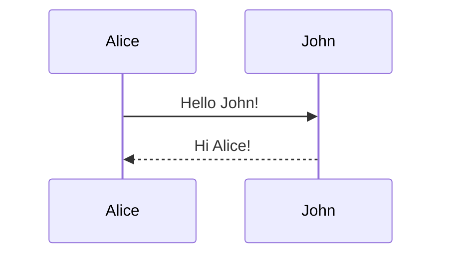
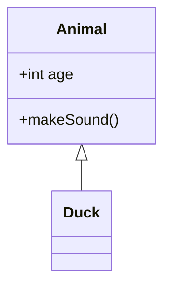
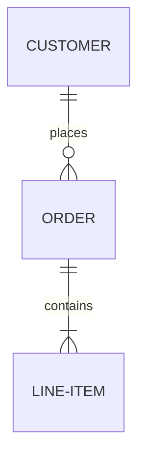
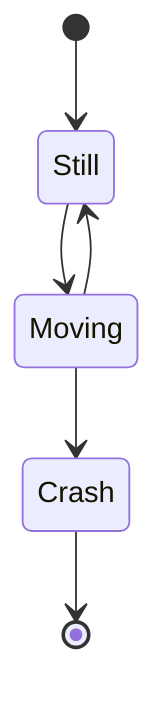
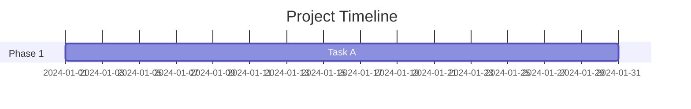
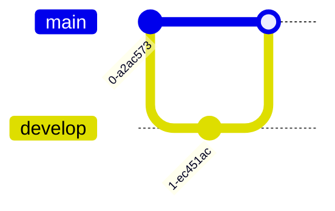

# Mermaid Diagrams - Agent Usage Guide

## Core Concept
Mermaid is a diagramming and charting tool that uses text-based syntax to create diagrams. It's perfect for creating visual documentation that lives in markdown files and version control.

## Critical Reference Files
**IMPORTANT**: Before creating diagrams, read the appropriate reference file:

- [Sequence Diagrams](references/sequence-diagram.md) - Interaction flows, API calls, process flows
- [Class Diagrams](references/class-diagram.md) - Object-oriented design, data models
- [ER Diagrams](references/er-diagram.md) - Database schemas, entity relationships
- [State Diagrams](references/state-diagram.md) - State machines, workflow states
- [Gantt Charts](references/gantt.md) - Project timelines, task scheduling
- [Git Graphs](references/gitgraph.md) - Git branching strategies, version control flows

## Decision Tree: Which Diagram Type?

### When user wants to show INTERACTIONS or FLOWS:
1. **API calls** → [Sequence Diagram](references/sequence-diagram.md)
2. **User workflows** → [Sequence Diagram](references/sequence-diagram.md)
3. **Process flows** → [Sequence Diagram](references/sequence-diagram.md)
4. **Message passing** → [Sequence Diagram](references/sequence-diagram.md)

### When user wants to show STRUCTURE or RELATIONSHIPS:
1. **Class relationships** → [Class Diagram](references/class-diagram.md)
2. **Object-oriented design** → [Class Diagram](references/class-diagram.md)
3. **Database schema** → [ER Diagram](references/er-diagram.md)
4. **Data models** → [ER Diagram](references/er-diagram.md)
5. **Entity relationships** → [ER Diagram](references/er-diagram.md)

### When user wants to show STATES or TRANSITIONS:
1. **State machines** → [State Diagram](references/state-diagram.md)
2. **Workflow states** → [State Diagram](references/state-diagram.md)
3. **Application lifecycle** → [State Diagram](references/state-diagram.md)

### When user wants to show TIMELINES or SCHEDULES:
1. **Project timeline** → [Gantt Chart](references/gantt.md)
2. **Task scheduling** → [Gantt Chart](references/gantt.md)
3. **Milestone tracking** → [Gantt Chart](references/gantt.md)

### When user wants to show GIT WORKFLOWS:
1. **Branching strategy** → [Git Graph](references/gitgraph.md)
2. **Release process** → [Git Graph](references/gitgraph.md)
3. **Merge workflows** → [Git Graph](references/gitgraph.md)

## Core Principles

1. **Text-based** - Diagrams are code, can be version controlled
2. **Simple syntax** - Easy to write and read
3. **Automatic layout** - Mermaid handles positioning
4. **Markdown compatible** - Embed directly in documentation
5. **Live rendering** - Preview in real-time

## Basic Workflow

```
1. Identify diagram type needed
   ↓
2. Read appropriate reference file
   ├─ sequence-diagram.md for interactions
   ├─ class-diagram.md for structure
   ├─ er-diagram.md for data models
   ├─ state-diagram.md for states
   ├─ gantt.md for timelines
   └─ gitgraph.md for git workflows
   ↓
3. Follow syntax from reference
   ├─ Start with diagram declaration
   ├─ Define entities/participants
   ├─ Add relationships/transitions
   └─ Customize as needed
   ↓
4. Test rendering
   ├─ Use Mermaid Live Editor
   ├─ Or preview in VSCode
   └─ Verify output matches intent
```

## Quick Examples

### Sequence Diagram


### Class Diagram


### ER Diagram


### State Diagram


### Gantt Chart


### Git Graph


## Best Practices

1. **Keep it simple** - Don't overcomplicate diagrams
2. **Use meaningful names** - Clear labels and descriptions
3. **Add context** - Include titles and section labels
4. **Test early** - Verify syntax as you build
5. **Document purpose** - Add comments explaining the diagram

## Common Pitfalls to Avoid

1. ❌ Too many entities → ✅ Break into multiple diagrams
2. ❌ Unclear labels → ✅ Use descriptive names
3. ❌ Missing diagram type → ✅ Always declare diagram type first
4. ❌ Syntax errors → ✅ Check reference files for correct syntax
5. ❌ No testing → ✅ Preview before finalizing

## Integration Points

### With Documentation
- Embed in README.md files
- Include in technical specs
- Add to API documentation
- Use in architecture docs

### With Python Projects
- Document class hierarchies
- Show API flows
- Visualize state machines
- Diagram data models

### With GitLab
- Add to merge request descriptions
- Include in issue descriptions
- Document in wiki pages
- Show in project documentation

## Testing Diagrams

### Online Tools
- [Mermaid Live Editor](https://mermaid.live/) - Official online editor
- Preview directly in GitHub/GitLab
- VSCode with Mermaid extensions

### VSCode Extensions
- Markdown Preview Mermaid Support
- Mermaid Markdown Syntax Highlighting
- Mermaid Editor

## Quick Reference Commands

```bash
# No CLI needed - Mermaid renders in markdown viewers

# For standalone rendering, use:
# - GitHub/GitLab markdown rendering
# - VSCode preview
# - Mermaid Live Editor (https://mermaid.live/)
```

## When to Use Each Diagram Type

| Use Case | Diagram Type | Reference |
|----------|-------------|-----------|
| API interactions | Sequence | [sequence-diagram.md](references/sequence-diagram.md) |
| Class structure | Class | [class-diagram.md](references/class-diagram.md) |
| Database schema | ER | [er-diagram.md](references/er-diagram.md) |
| State machines | State | [state-diagram.md](references/state-diagram.md) |
| Project timeline | Gantt | [gantt.md](references/gantt.md) |
| Git workflows | GitGraph | [gitgraph.md](references/gitgraph.md) |
