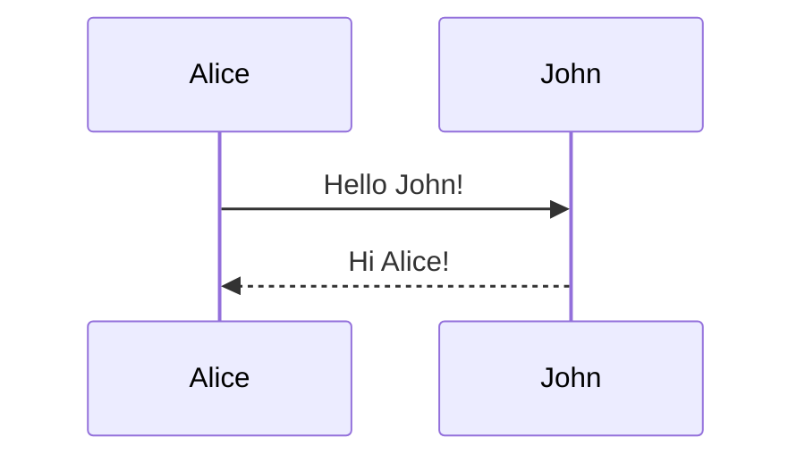
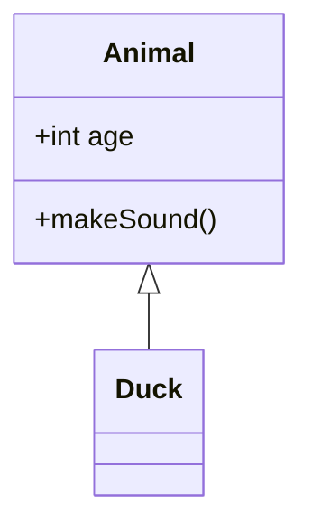
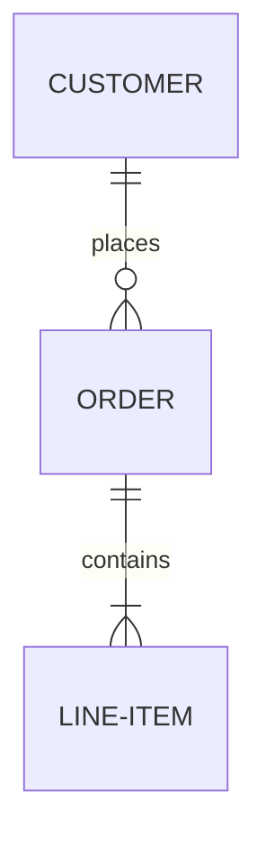
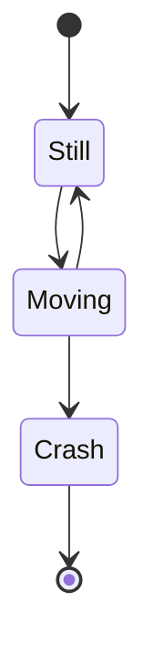
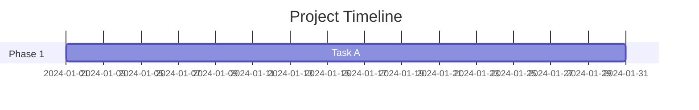

# Mermaid Diagrams - Agent Usage Guide

## Core Concept
Mermaid is a diagramming and charting tool that uses text-based syntax to create diagrams. It's perfect for creating visual documentation that lives in markdown files and version control.

## Critical Reference Files
**IMPORTANT**: Before creating diagrams, read the appropriate reference file:

- [Sequence Diagrams](references/sequence-diagram.md) - Interaction flows, API calls, process flows
- [Class Diagrams](references/class-diagram.md) - Object-oriented design, data models
- [ER Diagrams](references/er-diagram.md) - Database schemas, entity relationships
- [State Diagrams](references/state-diagram.md) - State machines, workflow states
- [Gantt Charts](references/gantt.md) - Project timelines, task scheduling
- [Git Graphs](references/gitgraph.md) - Git branching strategies, version control flows

## Decision Tree: Which Diagram Type?

### When user wants to show INTERACTIONS or FLOWS:
1. **API calls** → [Sequence Diagram](references/sequence-diagram.md)
2. **User workflows** → [Sequence Diagram](references/sequence-diagram.md)
3. **Process flows** → [Sequence Diagram](references/sequence-diagram.md)
4. **Message passing** → [Sequence Diagram](references/sequence-diagram.md)

### When user wants to show STRUCTURE or RELATIONSHIPS:
1. **Class relationships** → [Class Diagram](references/class-diagram.md)
2. **Object-oriented design** → [Class Diagram](references/class-diagram.md)
3. **Database schema** → [ER Diagram](references/er-diagram.md)
4. **Data models** → [ER Diagram](references/er-diagram.md)
5. **Entity relationships** → [ER Diagram](references/er-diagram.md)

### When user wants to show STATES or TRANSITIONS:
1. **State machines** → [State Diagram](references/state-diagram.md)
2. **Workflow states** → [State Diagram](references/state-diagram.md)
3. **Application lifecycle** → [State Diagram](references/state-diagram.md)

### When user wants to show TIMELINES or SCHEDULES:
1. **Project timeline** → [Gantt Chart](references/gantt.md)
2. **Task scheduling** → [Gantt Chart](references/gantt.md)
3. **Milestone tracking** → [Gantt Chart](references/gantt.md)

### When user wants to show GIT WORKFLOWS:
1. **Branching strategy** → [Git Graph](references/gitgraph.md)
2. **Release process** → [Git Graph](references/gitgraph.md)
3. **Merge workflows** → [Git Graph](references/gitgraph.md)

## Core Principles

1. **Text-based** - Diagrams are code, can be version controlled
2. **Simple syntax** - Easy to write and read
3. **Automatic layout** - Mermaid handles positioning
4. **Markdown compatible** - Embed directly in documentation
5. **Live rendering** - Preview in real-time

## Basic Workflow

```
1. Identify diagram type needed
   ↓
2. Read appropriate reference file
   ├─ sequence-diagram.md for interactions
   ├─ class-diagram.md for structure
   ├─ er-diagram.md for data models
   ├─ state-diagram.md for states
   ├─ gantt.md for timelines
   └─ gitgraph.md for git workflows
   ↓
3. Follow syntax from reference
   ├─ Start with diagram declaration
   ├─ Define entities/participants
   ├─ Add relationships/transitions
   └─ Customize as needed
   ↓
4. Test rendering
   ├─ Use Mermaid Live Editor
   ├─ Or preview in VSCode
   └─ Verify output matches intent
```

## Quick Examples

### Sequence Diagram


### Class Diagram


### ER Diagram


### State Diagram


### Gantt Chart


### Git Graph


## Best Practices

1. **Keep it simple** - Don't overcomplicate diagrams
2. **Use meaningful names** - Clear labels and descriptions
3. **Add context** - Include titles and section labels
4. **Test early** - Verify syntax as you build
5. **Document purpose** - Add comments explaining the diagram

## ⚠️ CRITICAL: File Safety When Working with Diagrams

### The Problem
When generating diagrams, you may need to organize them in folders like `docs/diagrams/`, `docs/images/`, etc. **NEVER** destructively delete directories without verifying their contents first.

### ❌ DANGEROUS PATTERNS - NEVER DO THIS

```bash
# ❌ WRONG: Deletes everything without checking
rm -rf docs/diagrams

# ❌ WRONG: Assumes folder is yours to delete
rm -rf docs/diagramms  # Typo in original folder name? Still don't delete!

# ❌ WRONG: No verification before destruction
mkdir -p docs/diagrams/er  # If docs/diagrams exists, you might delete other content
```

### ✅ SAFE PATTERNS - ALWAYS DO THIS

```bash
# ✅ STEP 1: CHECK what exists FIRST
ls -la docs/
find docs/ -type f  # List all files recursively
tree docs/          # If tree is available

# ✅ STEP 2: Review content before any deletion
ls -la docs/diagrams/
# If you see files you didn't create → STOP and ask user

# ✅ STEP 3A: Create in new subdirectory (safest)
mkdir -p docs/diagrams/er           # Only creates new subdirectory
mkdir -p docs/diagrams/generated    # Clear it's auto-generated

# ✅ STEP 3B: Only remove YOUR files specifically
rm -f docs/diagrams/er/*.png        # Only remove specific files you created
rm -f docs/diagrams/er/*.mmd

# ✅ STEP 3C: If must remove directory, verify empty first
if [ -z "$(ls -A docs/diagrams/er)" ]; then
    rmdir docs/diagrams/er  # Only works if empty
else
    echo "Directory not empty, please review contents"
    ls -la docs/diagrams/er
fi
```

### Safe Workflow for Diagram Generation

```bash
#!/bin/bash
# Safe diagram generation workflow

TARGET_DIR="docs/diagrams/er"

# 1. Check if directory exists and has content
if [ -d "$TARGET_DIR" ]; then
    echo "⚠️  Directory exists: $TARGET_DIR"
    echo "Current contents:"
    ls -la "$TARGET_DIR"
    
    # Count files
    file_count=$(find "$TARGET_DIR" -type f | wc -l)
    
    if [ "$file_count" -gt 0 ]; then
        echo "❌ ERROR: Directory contains $file_count file(s)"
        echo "Please review and manually clean if needed"
        exit 1
    fi
fi

# 2. Create directory safely
mkdir -p "$TARGET_DIR"

# 3. Generate diagrams
for mmd_file in *.mmd; do
    mmdc -i "$mmd_file" -o "$TARGET_DIR/${mmd_file%.mmd}.png" -s 10 -b transparent
done

echo "✓ Diagrams generated in $TARGET_DIR"
```

### Recovery Options (when you've already deleted)

```bash
# 1. Check git (if files were tracked)
git status docs/
git log --all --full-history -- docs/diagrams/

# 2. Check for IDE backups
ls -la .idea/       # IntelliJ/PyCharm
ls -la .vscode/     # VSCode local history

# 3. Check system trash (macOS)
ls -la ~/.Trash/

# 4. Time Machine (macOS)
tmutil listbackups

# 5. Ask user if they have backups
echo "⚠️  I may have deleted files. Do you have backups?"
```

### Before-and-After Checklist

**BEFORE touching any directory:**
- [ ] List directory contents: `ls -la target_dir/`
- [ ] Check if files are in git: `git status target_dir/`
- [ ] Confirm directory is yours to modify
- [ ] Ask user if unsure about existing content

**AFTER creating files:**
- [ ] Verify files created: `ls -la target_dir/`
- [ ] Test generated outputs (open PNGs, view diagrams)
- [ ] Document what was created in README
- [ ] Suggest adding to git if appropriate

### Real Example: The Right Way

```bash
# User asks: "Generate ER diagrams in docs/diagramms/er"
# Notice: User said "diagramms" (with double m)

# ❌ WRONG approach:
# rm -rf docs/diagramms  # Deletes user's existing folder!
# mkdir -p docs/diagramms/er

# ✅ RIGHT approach:
echo "Checking target directory..."
ls -la docs/diagramms/ 2>/dev/null || echo "Directory doesn't exist yet"

# If directory exists with content:
if [ -d "docs/diagramms" ]; then
    echo "Found existing docs/diagramms/ with:"
    find docs/diagramms -type f
    echo "Should I:"
    echo "  A) Create in docs/diagramms/er/ (preserves existing)"
    echo "  B) Create in docs/diagrams/er/ (standardize spelling)"
    # Wait for user response
fi

# Create safely
mkdir -p docs/diagramms/er  # Only creates subdirectory
# Generate diagrams...
```

### Key Principle

> **When in doubt, ASK the user before deleting anything.**
> 
> It's better to create a new subdirectory than to risk deleting user content.

### Testing Your Safety

```bash
# Test your safety practices
mkdir -p test_safety/existing
echo "important content" > test_safety/existing/data.txt

# Now try your workflow - it should:
# 1. Detect existing content
# 2. NOT delete data.txt
# 3. Either fail safely or create subdirectory

# Clean up test
rm -rf test_safety/
```

## Common Pitfalls to Avoid

1. ❌ Too many entities → ✅ Break into multiple diagrams
2. ❌ Unclear labels → ✅ Use descriptive names
3. ❌ Missing diagram type → ✅ Always declare diagram type first
4. ❌ Syntax errors → ✅ Check reference files for correct syntax
5. ❌ No testing → ✅ Preview before finalizing

## Integration Points

### With Documentation
- Embed in README.md files
- Include in technical specs
- Add to API documentation
- Use in architecture docs

### With Python Projects
- Document class hierarchies
- Show API flows
- Visualize state machines
- Diagram data models

### With GitLab
- Add to merge request descriptions
- Include in issue descriptions
- Document in wiki pages
- Show in project documentation

## Testing Diagrams

### Online Tools
- [Mermaid Live Editor](https://mermaid.live/) - Official online editor
- Preview directly in GitHub/GitLab
- VSCode with Mermaid extensions

### VSCode Extensions
- Markdown Preview Mermaid Support
- Mermaid Markdown Syntax Highlighting
- Mermaid Editor

## Mermaid CLI - Generate PNG/SVG/PDF Files

### Overview
`mermaid-cli` (`mmdc`) converts Mermaid diagrams to image files.

**Installation Status:** ✅ Already installed (mmdc v11.12.0)

### Basic Commands

```bash
# PNG (ALWAYS use scale=10 for high quality)
mmdc -i diagram.mmd -o diagram.png -s 10 -b transparent

# SVG (for web, scalable)
mmdc -i diagram.mmd -o diagram.svg

# PDF (for documents)
mmdc -i diagram.mmd -o diagram.pdf
```

### ⚠️ CRITICAL: PNG Generation Rule

**ALWAYS use `-s 10` (scale 10) when generating PNG files.**

```bash
# ✅ CORRECT - High quality PNG
mmdc -i diagram.mmd -o diagram.png -s 10 -b transparent

# ❌ WRONG - Low quality, blurry
mmdc -i diagram.mmd -o diagram.png
```

### Common Options

| Option | Value | Purpose |
|--------|-------|---------|
| `-s 10` | **Required for PNG** | Scale factor (high quality) |
| `-b transparent` | Recommended | Transparent background |
| `-t dark` | Optional | Dark theme |
| `-t default` | Default | Light theme |

### Batch Processing (Most Common Use Case)

```bash
# Generate PNGs from all .mmd files in directory
for file in *.mmd; do
    mmdc -i "$file" -o "${file%.mmd}.png" -s 10 -b transparent
done

# With dark theme
for file in *.mmd; do
    mmdc -i "$file" -o "${file%.mmd}.png" -s 10 -b transparent -t dark
done
```

### Quick Examples

#### Single PNG
```bash
mmdc -i diagram.mmd -o diagram.png -s 10 -b transparent
```

#### PNG with Dark Theme
```bash
mmdc -i diagram.mmd -o diagram.png -s 10 -b transparent -t dark
```

#### SVG (for web)
```bash
mmdc -i diagram.mmd -o diagram.svg
```

#### From stdin
```bash
cat << 'EOF' | mmdc -i - -o output.png -s 10 -b transparent
graph TD
    A[Start] --> B[End]
EOF
```

## Quick Reference

### Command Templates

```bash
# PNG (high quality, transparent)
mmdc -i diagram.mmd -o diagram.png -s 10 -b transparent

# PNG (dark theme)
mmdc -i diagram.mmd -o diagram.png -s 10 -b transparent -t dark

# SVG (for web)
mmdc -i diagram.mmd -o diagram.svg

# Batch process
for f in *.mmd; do mmdc -i "$f" -o "${f%.mmd}.png" -s 10 -b transparent; done
```

### Remember
- ✅ **Always use `-s 10` for PNG files**
- ✅ **Use `-b transparent` for flexible backgrounds**
- ✅ **Read reference files before creating diagrams**
- ✅ **Check directory contents before deletion**

## When to Use Each Diagram Type

| Use Case | Diagram Type | Reference |
|----------|-------------|-----------|
| API interactions | Sequence | [sequence-diagram.md](references/sequence-diagram.md) |
| Class structure | Class | [class-diagram.md](references/class-diagram.md) |
| Database schema | ER | [er-diagram.md](references/er-diagram.md) |
| State machines | State | [state-diagram.md](references/state-diagram.md) |
| Project timeline | Gantt | [gantt.md](references/gantt.md) |
| Git workflows | GitGraph | [gitgraph.md](references/gitgraph.md) |
