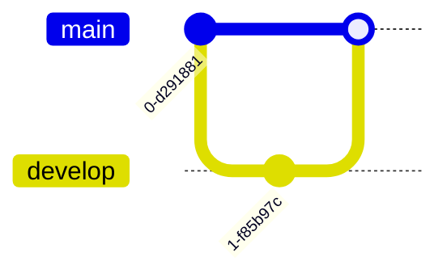

# Mermaid Diagrams - Agent Usage Guide

## Core Concept
Mermaid is a diagramming and charting tool that uses text-based syntax to create diagrams. It's perfect for creating visual documentation that lives in markdown files and version control.

## Critical Reference Files
**IMPORTANT**: Before creating diagrams, read the appropriate reference file:

- [Sequence Diagrams](references/sequence-diagram.md) - Interaction flows, API calls, process flows
- [Class Diagrams](references/class-diagram.md) - Object-oriented design, data models
- [ER Diagrams](references/er-diagram.md) - Database schemas, entity relationships
- [State Diagrams](references/state-diagram.md) - State machines, workflow states
- [Gantt Charts](references/gantt.md) - Project timelines, task scheduling
- [Git Graphs](references/gitgraph.md) - Git branching strategies, version control flows

## Decision Tree: Which Diagram Type?

### When user wants to show INTERACTIONS or FLOWS:
1. **API calls** → [Sequence Diagram](references/sequence-diagram.md)
2. **User workflows** → [Sequence Diagram](references/sequence-diagram.md)
3. **Process flows** → [Sequence Diagram](references/sequence-diagram.md)
4. **Message passing** → [Sequence Diagram](references/sequence-diagram.md)

### When user wants to show STRUCTURE or RELATIONSHIPS:
1. **Class relationships** → [Class Diagram](references/class-diagram.md)
2. **Object-oriented design** → [Class Diagram](references/class-diagram.md)
3. **Database schema** → [ER Diagram](references/er-diagram.md)
4. **Data models** → [ER Diagram](references/er-diagram.md)
5. **Entity relationships** → [ER Diagram](references/er-diagram.md)

### When user wants to show STATES or TRANSITIONS:
1. **State machines** → [State Diagram](references/state-diagram.md)
2. **Workflow states** → [State Diagram](references/state-diagram.md)
3. **Application lifecycle** → [State Diagram](references/state-diagram.md)

### When user wants to show TIMELINES or SCHEDULES:
1. **Project timeline** → [Gantt Chart](references/gantt.md)
2. **Task scheduling** → [Gantt Chart](references/gantt.md)
3. **Milestone tracking** → [Gantt Chart](references/gantt.md)

### When user wants to show GIT WORKFLOWS:
1. **Branching strategy** → [Git Graph](references/gitgraph.md)
2. **Release process** → [Git Graph](references/gitgraph.md)
3. **Merge workflows** → [Git Graph](references/gitgraph.md)

## Core Principles

1. **Text-based** - Diagrams are code, can be version controlled
2. **Simple syntax** - Easy to write and read
3. **Automatic layout** - Mermaid handles positioning
4. **Markdown compatible** - Embed directly in documentation
5. **Live rendering** - Preview in real-time

## Basic Workflow

```
1. Identify diagram type needed
   ↓
2. Read appropriate reference file
   ├─ sequence-diagram.md for interactions
   ├─ class-diagram.md for structure
   ├─ er-diagram.md for data models
   ├─ state-diagram.md for states
   ├─ gantt.md for timelines
   └─ gitgraph.md for git workflows
   ↓
3. Follow syntax from reference
   ├─ Start with diagram declaration
   ├─ Define entities/participants
   ├─ Add relationships/transitions
   └─ Customize as needed
   ↓
4. Test rendering
   ├─ Use Mermaid Live Editor
   ├─ Or preview in VSCode
   └─ Verify output matches intent
```

## Quick Examples

### Sequence Diagram


### Class Diagram


### ER Diagram


### State Diagram


### Gantt Chart


### Git Graph


## Best Practices

1. **Keep it simple** - Don't overcomplicate diagrams
2. **Use meaningful names** - Clear labels and descriptions
3. **Add context** - Include titles and section labels
4. **Test early** - Verify syntax as you build
5. **Document purpose** - Add comments explaining the diagram

## ⚠️ CRITICAL: File Safety When Working with Diagrams

### The Problem
When generating diagrams, you may need to organize them in folders like `docs/diagrams/`, `docs/images/`, etc. **NEVER** destructively delete directories without verifying their contents first.

### ❌ DANGEROUS PATTERNS - NEVER DO THIS

```bash
# ❌ WRONG: Deletes everything without checking
rm -rf docs/diagrams

# ❌ WRONG: Assumes folder is yours to delete
rm -rf docs/diagramms  # Typo in original folder name? Still don't delete!

# ❌ WRONG: No verification before destruction
mkdir -p docs/diagrams/er  # If docs/diagrams exists, you might delete other content
```

### ✅ SAFE PATTERNS - ALWAYS DO THIS

```bash
# ✅ STEP 1: CHECK what exists FIRST
ls -la docs/
find docs/ -type f  # List all files recursively
tree docs/          # If tree is available

# ✅ STEP 2: Review content before any deletion
ls -la docs/diagrams/
# If you see files you didn't create → STOP and ask user

# ✅ STEP 3A: Create in new subdirectory (safest)
mkdir -p docs/diagrams/er           # Only creates new subdirectory
mkdir -p docs/diagrams/generated    # Clear it's auto-generated

# ✅ STEP 3B: Only remove YOUR files specifically
rm -f docs/diagrams/er/*.png        # Only remove specific files you created
rm -f docs/diagrams/er/*.mmd

# ✅ STEP 3C: If must remove directory, verify empty first
if [ -z "$(ls -A docs/diagrams/er)" ]; then
    rmdir docs/diagrams/er  # Only works if empty
else
    echo "Directory not empty, please review contents"
    ls -la docs/diagrams/er
fi
```

### Safe Workflow for Diagram Generation

```bash
#!/bin/bash
# Safe diagram generation workflow

TARGET_DIR="docs/diagrams/er"

# 1. Check if directory exists and has content
if [ -d "$TARGET_DIR" ]; then
    echo "⚠️  Directory exists: $TARGET_DIR"
    echo "Current contents:"
    ls -la "$TARGET_DIR"
    
    # Count files
    file_count=$(find "$TARGET_DIR" -type f | wc -l)
    
    if [ "$file_count" -gt 0 ]; then
        echo "❌ ERROR: Directory contains $file_count file(s)"
        echo "Please review and manually clean if needed"
        exit 1
    fi
fi

# 2. Create directory safely
mkdir -p "$TARGET_DIR"

# 3. Generate diagrams
for mmd_file in *.mmd; do
    mmdc -i "$mmd_file" -o "$TARGET_DIR/${mmd_file%.mmd}.png"
done

echo "✓ Diagrams generated in $TARGET_DIR"
```

### Recovery Options (when you've already deleted)

```bash
# 1. Check git (if files were tracked)
git status docs/
git log --all --full-history -- docs/diagrams/

# 2. Check for IDE backups
ls -la .idea/       # IntelliJ/PyCharm
ls -la .vscode/     # VSCode local history

# 3. Check system trash (macOS)
ls -la ~/.Trash/

# 4. Time Machine (macOS)
tmutil listbackups

# 5. Ask user if they have backups
echo "⚠️  I may have deleted files. Do you have backups?"
```

### Before-and-After Checklist

**BEFORE touching any directory:**
- [ ] List directory contents: `ls -la target_dir/`
- [ ] Check if files are in git: `git status target_dir/`
- [ ] Confirm directory is yours to modify
- [ ] Ask user if unsure about existing content

**AFTER creating files:**
- [ ] Verify files created: `ls -la target_dir/`
- [ ] Test generated outputs (open PNGs, view diagrams)
- [ ] Document what was created in README
- [ ] Suggest adding to git if appropriate

### Real Example: The Right Way

```bash
# User asks: "Generate ER diagrams in docs/diagramms/er"
# Notice: User said "diagramms" (with double m)

# ❌ WRONG approach:
# rm -rf docs/diagramms  # Deletes user's existing folder!
# mkdir -p docs/diagramms/er

# ✅ RIGHT approach:
echo "Checking target directory..."
ls -la docs/diagramms/ 2>/dev/null || echo "Directory doesn't exist yet"

# If directory exists with content:
if [ -d "docs/diagramms" ]; then
    echo "Found existing docs/diagramms/ with:"
    find docs/diagramms -type f
    echo "Should I:"
    echo "  A) Create in docs/diagramms/er/ (preserves existing)"
    echo "  B) Create in docs/diagrams/er/ (standardize spelling)"
    # Wait for user response
fi

# Create safely
mkdir -p docs/diagramms/er  # Only creates subdirectory
# Generate diagrams...
```

### Key Principle

> **When in doubt, ASK the user before deleting anything.**
> 
> It's better to create a new subdirectory than to risk deleting user content.

### Testing Your Safety

```bash
# Test your safety practices
mkdir -p test_safety/existing
echo "important content" > test_safety/existing/data.txt

# Now try your workflow - it should:
# 1. Detect existing content
# 2. NOT delete data.txt
# 3. Either fail safely or create subdirectory

# Clean up test
rm -rf test_safety/
```

## Common Pitfalls to Avoid

1. ❌ Too many entities → ✅ Break into multiple diagrams
2. ❌ Unclear labels → ✅ Use descriptive names
3. ❌ Missing diagram type → ✅ Always declare diagram type first
4. ❌ Syntax errors → ✅ Check reference files for correct syntax
5. ❌ No testing → ✅ Preview before finalizing

## Integration Points

### With Documentation
- Embed in README.md files
- Include in technical specs
- Add to API documentation
- Use in architecture docs

### With Python Projects
- Document class hierarchies
- Show API flows
- Visualize state machines
- Diagram data models

### With GitLab
- Add to merge request descriptions
- Include in issue descriptions
- Document in wiki pages
- Show in project documentation

## Testing Diagrams

### Online Tools
- [Mermaid Live Editor](https://mermaid.live/) - Official online editor
- Preview directly in GitHub/GitLab
- VSCode with Mermaid extensions

### VSCode Extensions
- Markdown Preview Mermaid Support
- Mermaid Markdown Syntax Highlighting
- Mermaid Editor

## Mermaid CLI - Generate PNG/SVG/PDF Files

### Overview
`mermaid-cli` (`mmdc`) is a command-line tool to convert Mermaid diagrams to image files (PNG, SVG, PDF). Use this when you need standalone images for presentations, documentation, or embedding in non-markdown formats.

**Installation Status:** ✅ Already installed (mmdc v11.12.0)

### Basic Usage

```bash
# Convert .mmd file to SVG (default)
mmdc -i diagram.mmd -o diagram.svg

# Convert to PNG
mmdc -i diagram.mmd -o diagram.png --scale=10

# Convert to PDF
mmdc -i diagram.mmd -o diagram.pdf

# Read from stdin
cat diagram.mmd | mmdc -i -

# Use heredoc
cat << EOF | mmdc -i - -o output.svg
graph TD
    A[Start] --> B[End]
EOF
```

### Common Options

```bash
# Theme options
mmdc -i input.mmd -o output.png -t dark           # Dark theme
mmdc -i input.mmd -o output.png -t forest         # Forest theme
mmdc -i input.mmd -o output.png -t neutral        # Neutral theme

# Background color
mmdc -i input.mmd -o output.png -b transparent    # Transparent background
mmdc -i input.mmd -o output.png -b white          # White background
mmdc -i input.mmd -o output.png -b '#F0F0F0'      # Custom color

# Dimensions
mmdc -i input.mmd -o output.png -w 1200           # Width: 1200px
mmdc -i input.mmd -o output.png -H 800            # Height: 800px
mmdc -i input.mmd -o output.png -s 2              # Scale: 2x

# Configuration
mmdc -i input.mmd -o output.svg -c config.json    # Custom config
mmdc -i input.mmd -o output.svg -C styles.css     # Custom CSS
```

### Process Markdown Files

Mermaid CLI can extract and render all diagrams from markdown files:

```bash
# Extract and generate images from markdown
mmdc -i README.md -o README-rendered.md

# This transforms:
# ```mermaid
# graph TD
#     A-->B
# ```
# 
# Into:
# 
```

### Practical Examples

#### 1. Generate PNG with Dark Theme for Presentation

```bash
# Create diagram file
cat << 'EOF' > architecture.mmd
graph TB
    subgraph "Frontend"
        Web[Web App]
        Mobile[Mobile App]
    end
    subgraph "Backend"
        API[API Gateway]
        Auth[Auth Service]
        DB[(Database)]
    end
    Web --> API
    Mobile --> API
    API --> Auth
    API --> DB
EOF

# Generate high-res PNG with dark theme
mmdc -i architecture.mmd -o architecture.png \
    -t dark \
    -b transparent \
    -w 1920 \
    -s 2

echo "✓ Generated: architecture.png"
```

#### 2. Generate Multiple Formats from One Diagram

```bash
#!/bin/bash
# Generate PNG, SVG, and PDF from single source

INPUT="flowchart.mmd"

# Create the diagram
cat << 'EOF' > "$INPUT"
flowchart LR
    Start([Start]) --> Process[Process Data]
    Process --> Decision{Success?}
    Decision -->|Yes| Success[Complete]
    Decision -->|No| Error[Handle Error]
    Error --> Process
    Success --> End([End])
EOF

# Generate all formats
mmdc -i "$INPUT" -o flowchart.svg -t default
mmdc -i "$INPUT" -o flowchart.png -t default -b transparent
mmdc -i "$INPUT" -o flowchart.pdf -t default

echo "✓ Generated: flowchart.{svg,png,pdf}"
```

#### 3. Batch Process Multiple Diagrams

```bash
#!/bin/bash
# Convert all .mmd files in directory to PNG

for mmd_file in diagrams/*.mmd; do
    filename=$(basename "$mmd_file" .mmd)
    echo "Processing: $filename"
    
    mmdc -i "$mmd_file" \
         -o "output/${filename}.png" \
         -t dark \
         -b transparent \
         -w 1200
    
    echo "✓ Generated: output/${filename}.png"
done
```

#### 4. Generate from Template with Variables

```bash
#!/bin/bash
# Generate diagram with dynamic content

SERVICE_NAME="UserService"
DB_NAME="UserDB"

cat << EOF | mmdc -i - -o service-diagram.svg
sequenceDiagram
    participant Client
    participant ${SERVICE_NAME}
    participant ${DB_NAME}
    
    Client->>+${SERVICE_NAME}: Request
    ${SERVICE_NAME}->>+${DB_NAME}: Query
    ${DB_NAME}-->>-${SERVICE_NAME}: Result
    ${SERVICE_NAME}-->>-Client: Response
EOF

echo "✓ Generated: service-diagram.svg"
```

#### 5. Extract Diagrams from Markdown Documentation

```bash
# Process markdown file and extract all diagrams
mmdc -i docs/architecture.md -o docs/architecture-rendered.md

# This will:
# 1. Find all ```mermaid code blocks
# 2. Generate SVG files (architecture-1.svg, architecture-2.svg, etc.)
# 3. Replace code blocks with image references
# 4. Create new markdown file with images
```

#### 6. CI/CD Integration - Generate Diagrams on Commit

```yaml
# .gitlab-ci.yml
generate-diagrams:
  stage: build
  image: node:18
  before_script:
    - npm install -g @mermaid-js/mermaid-cli
  script:
    - |
      for file in docs/diagrams/*.mmd; do
        filename=$(basename "$file" .mmd)
        mmdc -i "$file" -o "docs/images/${filename}.png" -t dark -b transparent
      done
  artifacts:
    paths:
      - docs/images/*.png
    expire_in: 30 days
```

#### 7. Create Diagram with Custom Configuration

```bash
# Create config file
cat << 'EOF' > mermaid-config.json
{
  "theme": "dark",
  "themeVariables": {
    "primaryColor": "#BB86FC",
    "primaryTextColor": "#fff",
    "primaryBorderColor": "#7C4DFF",
    "lineColor": "#F57C00",
    "secondaryColor": "#03DAC6",
    "tertiaryColor": "#fff"
  },
  "flowchart": {
    "curve": "basis"
  }
}
EOF

# Generate with custom config
mmdc -i diagram.mmd -o diagram.png -c mermaid-config.json
```

#### 8. Troubleshooting - Verify Installation

```bash
# Check mmdc is installed
which mmdc
# Output: /opt/homebrew/bin/mmdc (or similar)

# Check version
mmdc --version
# Output: 11.12.0 (or similar)

# Test basic rendering
echo 'graph TD; A-->B' | mmdc -i - -o test.svg && \
    echo "✓ Working!" || echo "✗ Failed"

# View help
mmdc --help
```

### Output Format Options

| Extension | Format | Use Case |
|-----------|--------|----------|
| `.svg` | SVG | Web, scalable, default |
| `.png` | PNG | Images, presentations, high DPI |
| `.pdf` | PDF | Documents, printing |
| `-` (stdout) | Any | Piping to other tools |

### Theme Options

| Theme | Description | Use Case |
|-------|-------------|----------|
| `default` | Light theme | General documentation |
| `dark` | Dark theme | Presentations, dark mode docs |
| `forest` | Green tones | Nature/growth themes |
| `neutral` | Minimal style | Professional documents |

### Common Patterns

#### Quick PNG Generation
```bash
# One-liner: create diagram and generate PNG
cat << 'EOF' | mmdc -i - -o diagram.png -b transparent
graph LR
    A[Input] --> B[Process] --> C[Output]
EOF
```

#### High-Quality Image for Presentation
```bash
mmdc -i diagram.mmd \
     -o presentation.png \
     -t dark \
     -b transparent \
     -w 2560 \
     -H 1440 \
     -s 2
```

#### Automated Documentation Build
```bash
#!/bin/bash
# Update all diagrams in docs/

echo "Updating diagrams..."
for mmd in docs/diagrams/*.mmd; do
    base=$(basename "$mmd" .mmd)
    mmdc -i "$mmd" -o "docs/images/${base}.svg" -q
done
echo "✓ All diagrams updated"
```

### Best Practices

1. **Use Transparent Backgrounds** - Better for presentations and dark mode
   ```bash
   mmdc -i diagram.mmd -o diagram.png -b transparent
   ```

2. **High DPI for Presentations** - Use scale factor for crisp images
   ```bash
   mmdc -i diagram.mmd -o diagram.png -s 2 -w 1920
   ```

3. **SVG for Web** - Smaller file size, scalable
   ```bash
   mmdc -i diagram.mmd -o diagram.svg
   ```

4. **Version Control .mmd Files** - Keep source, generate images in CI/CD
   ```bash
   # .gitignore
   *.png
   *.svg
   # Keep .mmd files in git
   ```

5. **Quiet Mode for Scripts** - Suppress output in automation
   ```bash
   mmdc -i diagram.mmd -o diagram.png -q
   ```

### Troubleshooting

**"Command not found: mmdc"**
```bash
# Install globally
npm install -g @mermaid-js/mermaid-cli

# Or use npx
npx -p @mermaid-js/mermaid-cli mmdc -i diagram.mmd -o diagram.svg
```

**"Error: Cannot find module 'puppeteer'"**
```bash
# Reinstall with all dependencies
npm install -g @mermaid-js/mermaid-cli --force
```

**Large diagrams cut off**
```bash
# Increase dimensions
mmdc -i large.mmd -o large.png -w 2400 -H 1800
```

**Diagram syntax errors**
```bash
# Test syntax first at https://mermaid.live/
# Then generate with mmdc
```

### Shell Integration

```bash
# Add to .bashrc or .zshrc
alias mmd2png='mmdc -i - -o'
alias mmd2svg='mmdc -i - -o'

# Usage:
cat diagram.mmd | mmd2png output.png
echo 'graph TD; A-->B' | mmd2svg output.svg
```

### Quick Reference - mmdc Commands

```bash
# Basic
mmdc -i input.mmd -o output.svg                  # Default SVG
mmdc -i input.mmd -o output.png                  # PNG
mmdc -i input.mmd -o output.pdf                  # PDF

# With options
mmdc -i input.mmd -o output.png -t dark          # Dark theme
mmdc -i input.mmd -o output.png -b transparent   # Transparent bg
mmdc -i input.mmd -o output.png -w 1920 -s 2     # High DPI

# From stdin
echo 'graph TD; A-->B' | mmdc -i -               # SVG to stdout
cat diagram.mmd | mmdc -i - -o output.png        # Pipe input

# Markdown processing
mmdc -i README.md -o README-rendered.md          # Extract & render

# Batch
for f in *.mmd; do mmdc -i "$f" -o "${f%.mmd}.png"; done
```

## Quick Reference Commands

```bash
# Viewing diagrams (no CLI needed)
# - GitHub/GitLab markdown rendering
# - VSCode preview
# - Mermaid Live Editor (https://mermaid.live/)

# Generating image files (with mmdc)
mmdc -i diagram.mmd -o diagram.png               # Generate PNG
mmdc -i diagram.mmd -o diagram.svg               # Generate SVG
mmdc -i diagram.mmd -o diagram.pdf               # Generate PDF

# Common patterns
echo 'graph TD; A-->B' | mmdc -i - -o out.png   # From stdin
mmdc -i diagram.mmd -o out.png -t dark -b transparent  # Dark + transparent
```

## When to Use Each Diagram Type

| Use Case | Diagram Type | Reference |
|----------|-------------|-----------|
| API interactions | Sequence | [sequence-diagram.md](references/sequence-diagram.md) |
| Class structure | Class | [class-diagram.md](references/class-diagram.md) |
| Database schema | ER | [er-diagram.md](references/er-diagram.md) |
| State machines | State | [state-diagram.md](references/state-diagram.md) |
| Project timeline | Gantt | [gantt.md](references/gantt.md) |
| Git workflows | GitGraph | [gitgraph.md](references/gitgraph.md) |
