# Mermaid Class Diagrams

## Basic Syntax

### Diagram Declaration
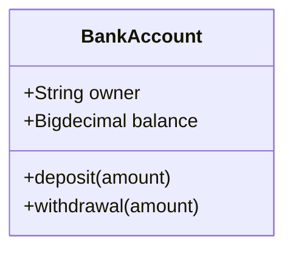

## Defining Classes

### Explicit Class Declaration
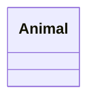

### Via Relationship
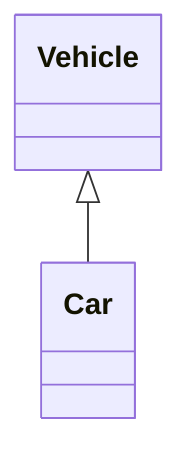

### Class Labels
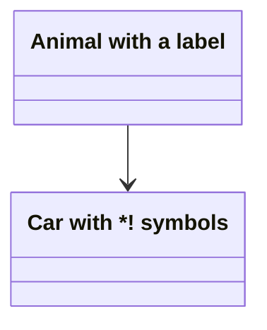

Using backticks for special characters:
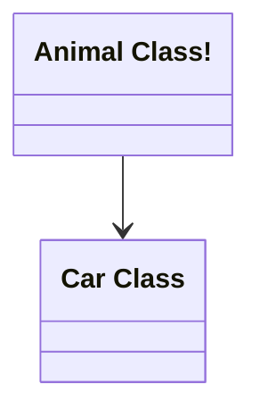

## Class Members

### Method 1: Colon Syntax
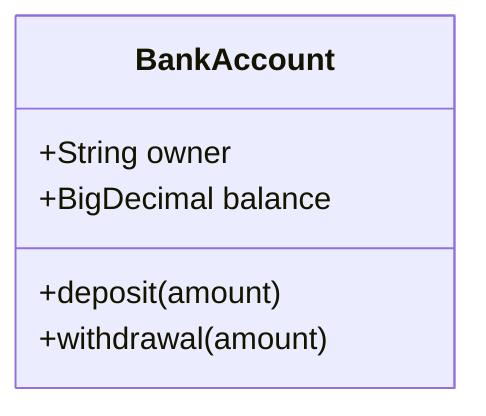

### Method 2: Curly Braces


### Return Types
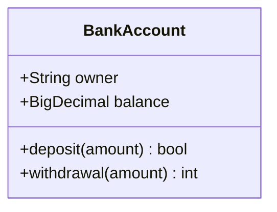

### Generic Types
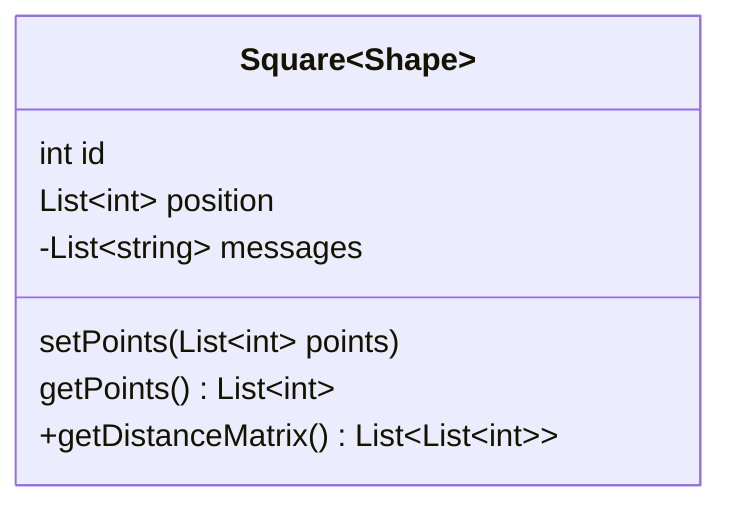

### Visibility

| Symbol | Meaning |
|--------|---------|
| `+` | Public |
| `-` | Private |
| `#` | Protected |
| `~` | Package/Internal |

### Method Classifiers

- `*` Abstract: `someAbstractMethod()* int*`
- `$` Static: `someStaticMethod()$ String$`

### Field Classifiers

- `$` Static: `String someField$`

## Relationships

### Relationship Types

| Syntax | Type | Description |
|--------|------|-------------|
| `<|--` | Inheritance | Class inheritance |
| `*--` | Composition | Composition |
| `o--` | Aggregation | Aggregation |
| `-->` | Association | Association |
| `--` | Link (Solid) | Solid link |
| `..>` | Dependency | Dependency |
| `..|>` | Realization | Realization |
| `..` | Link (Dashed) | Dashed link |

### Basic Relationships
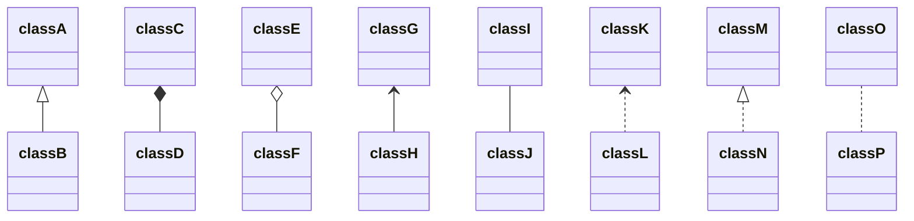

### Labels on Relations
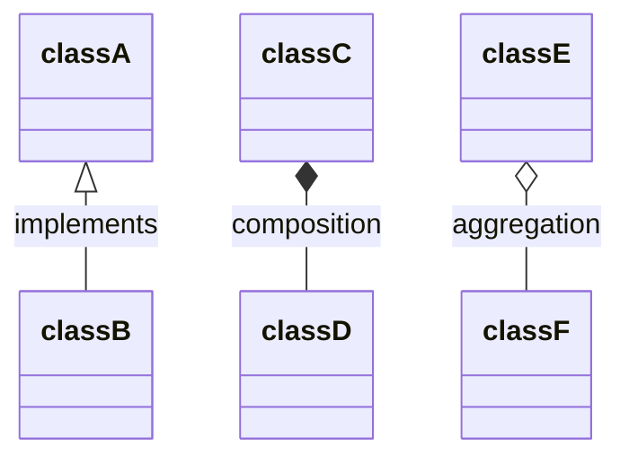

### Two-way Relations
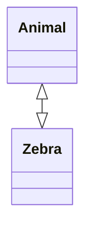

Syntax: `[Relation Type][Link][Relation Type]`

Relation Types: `<|` (Inheritance), `*` (Composition), `o` (Aggregation), `>` `<` (Association), `|>` (Realization)

Links: `--` (Solid), `..` (Dashed)

### Lollipop Interfaces
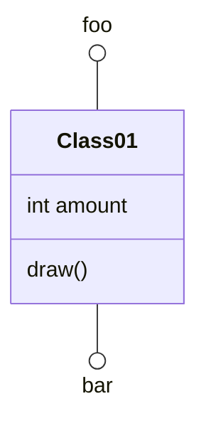

## Namespaces

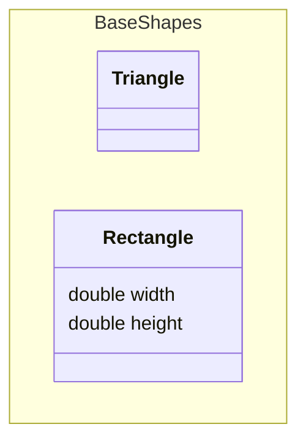

## Cardinality / Multiplicity

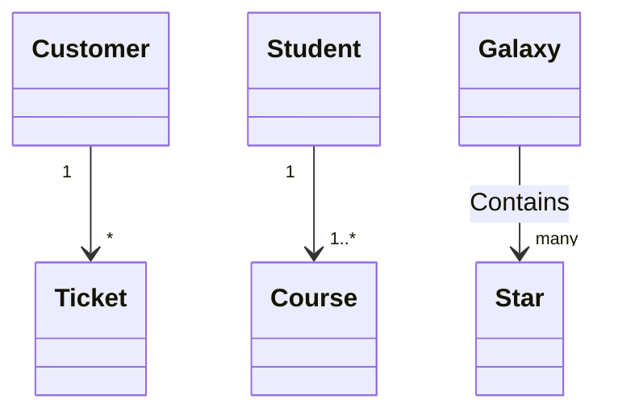

Options: `1`, `0..1`, `1..*`, `*`, `n`, `0..n`, `1..n`

## Annotations

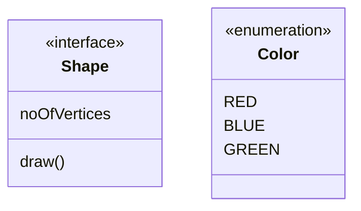

Common annotations: `<<Interface>>`, `<<Abstract>>`, `<<Service>>`, `<<Enumeration>>`

## Comments

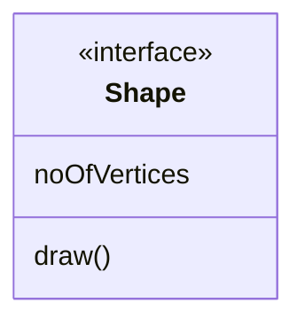

## Direction

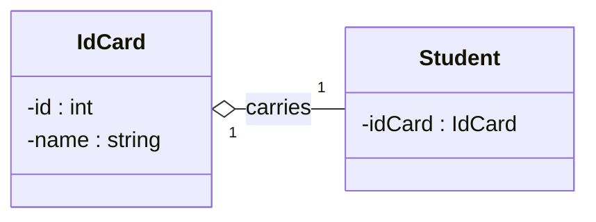

Options: `TB`, `BT`, `RL`, `LR`

## Interaction

### Links
```mermaid
classDiagram
    class Shape
    link Shape "https://www.github.com" "Tooltip"
    click Shape2 href "https://www.github.com" "Tooltip"
```

### Callbacks
```mermaid
classDiagram
    class Shape
    callback Shape "callbackFunction" "Tooltip"
    click Shape2 call callbackFunction() "Tooltip"
```

## Notes

```mermaid
classDiagram
    note "This is a general note"
    note for MyClass "This is a note for a class"
    class MyClass{
    }
```

## Styling

### Individual Node Styling
```mermaid
classDiagram
    class Animal
    class Mineral
    style Animal fill:#f9f,stroke:#333,stroke-width:4px
    style Mineral fill:#bbf,stroke:#f66,stroke-width:2px
```

### Class Definitions
```mermaid
classDiagram
    class Animal:::someclass
    classDef someclass fill:#f96
```

Or with members:
```mermaid
classDiagram
    class Animal:::someclass {
        -int sizeInFeet
        -canEat()
    }
    classDef someclass fill:#f96
```

### Default Class
```mermaid
classDiagram
    class Animal:::pink
    class Mineral
    
    classDef default fill:#f96,color:red
    classDef pink color:#f9f
```

## Configuration

### Hide Empty Members Box
```mermaid
---
config:
    class:
        hideEmptyMembersBox: true
---
classDiagram
    class Duck
```

## Best Practices

### Structure
- Use namespaces to group related classes
- Define interfaces and abstract classes with annotations
- Use meaningful class and member names

### Relationships
- Use appropriate relationship types
- Add labels to clarify relationships
- Show cardinality when relevant

### Visibility
- Use visibility modifiers consistently
- Mark static and abstract members appropriately
- Separate attributes from methods

## Common Patterns

### Inheritance Hierarchy
```mermaid
classDiagram
    Animal <|-- Duck
    Animal <|-- Fish
    Animal <|-- Zebra
    Animal : +int age
    Animal : +String gender
    Animal: +isMammal()
    Animal: +mate()
    class Duck{
        +String beakColor
        +swim()
        +quack()
    }
```

### Composition Pattern
```mermaid
classDiagram
    class Car {
        -Engine engine
        -Wheel[] wheels
        +start()
        +stop()
    }
    class Engine {
        +int horsepower
        +start()
        +stop()
    }
    class Wheel {
        +int size
        +rotate()
    }
    Car *-- Engine
    Car *-- Wheel
```

### Interface Implementation
```mermaid
classDiagram
    class Shape {
        <<interface>>
        +draw()
        +getArea() double
    }
    class Circle {
        -double radius
        +draw()
        +getArea() double
    }
    class Rectangle {
        -double width
        -double height
        +draw()
        +getArea() double
    }
    Shape <|.. Circle : implements
    Shape <|.. Rectangle : implements
```

### Design Pattern - Observer
```mermaid
classDiagram
    class Subject {
        <<interface>>
        +attach(Observer)
        +detach(Observer)
        +notify()
    }
    class Observer {
        <<interface>>
        +update()
    }
    class ConcreteSubject {
        -List~Observer~ observers
        -state
        +attach(Observer)
        +detach(Observer)
        +notify()
    }
    class ConcreteObserver {
        -Subject subject
        +update()
    }
    Subject <|.. ConcreteSubject
    Observer <|.. ConcreteObserver
    Subject o-- Observer
```

### Generic Collections
```mermaid
classDiagram
    class List~T~ {
        +add(T item)
        +get(int index) T
        +size() int
    }
    class ArrayList~T~ {
        -T[] elements
        +add(T item)
        +get(int index) T
    }
    List~T~ <|.. ArrayList~T~
```
