# Mermaid Entity Relationship Diagrams


## Basic Syntax

### Simple ER Diagram
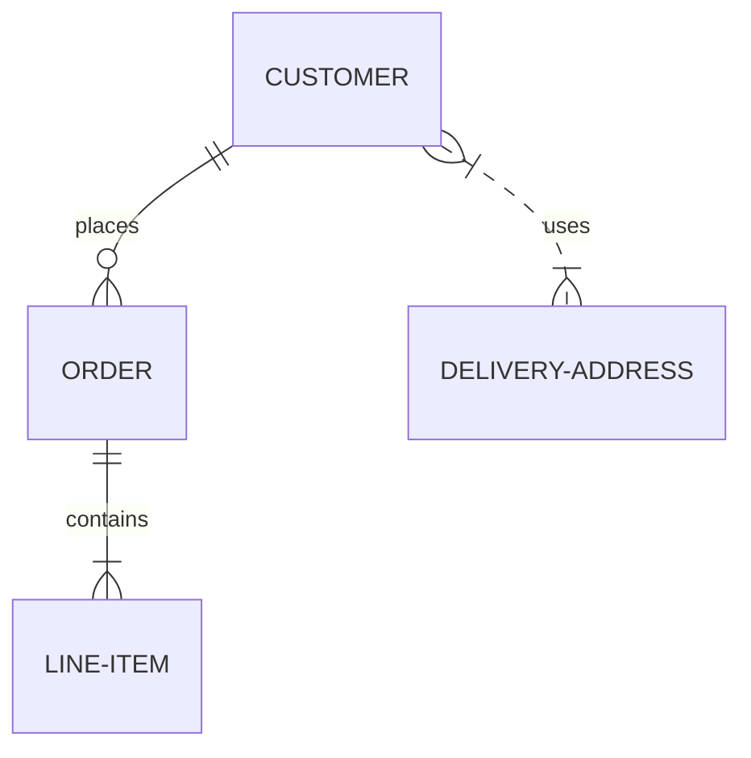

## Entities and Relationships

### Basic Syntax
```
<first-entity> [<relationship> <second-entity> : <relationship-label>]
```

Example:
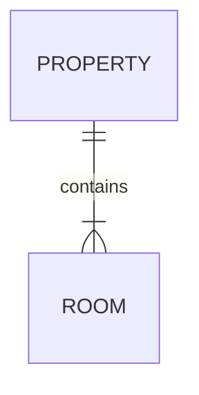

### Unicode and Markdown Support
```mermaid
erDiagram
    "This ❤ Unicode"
    "This **is** _Markdown_"
```

## Relationship Syntax

### Cardinality Markers

| Syntax | Meaning |
|--------|---------|
| `|o` `o|` | Zero or one |
| `||` `||` | Exactly one |
| `}o` `o{` | Zero or more |
| `}|` `|{` | One or more |

### Cardinality Aliases

| Alias | Symbol |
|-------|--------|
| `zero or one` `one or zero` | `|o` or `o|` |
| `only one` `1` | `||` |
| `zero or more` `zero or many` `many(0)` `0+` | `}o` or `o{` |
| `one or more` `one or many` `many(1)` `1+` | `}|` or `|{` |

### Identification

| Syntax | Type |
|--------|------|
| `--` | Identifying (solid line) |
| `..` | Non-identifying (dashed line) |

Aliases:
- `to` = identifying
- `optionally to` = non-identifying

Example:
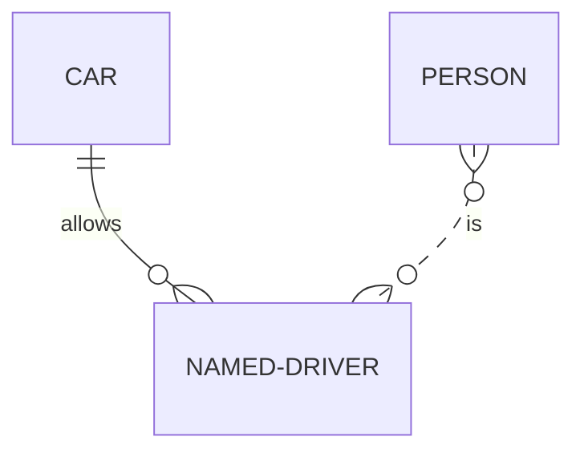

Using aliases:


## Attributes

### Basic Attributes
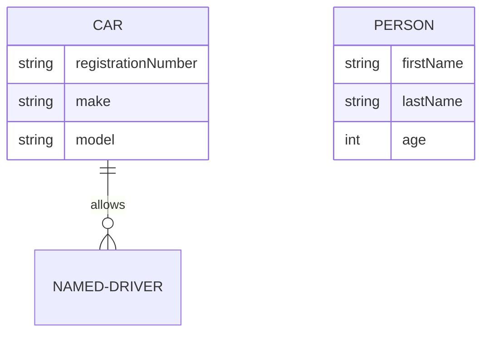

### Attribute Keys

- `PK` - Primary Key
- `FK` - Foreign Key
- `UK` - Unique Key

Multiple keys: `PK, FK`

### Attribute Comments
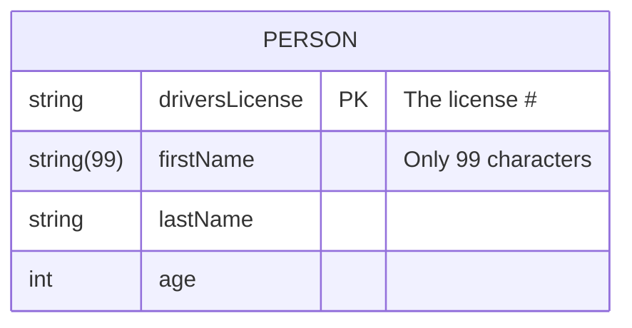

### Complete Example
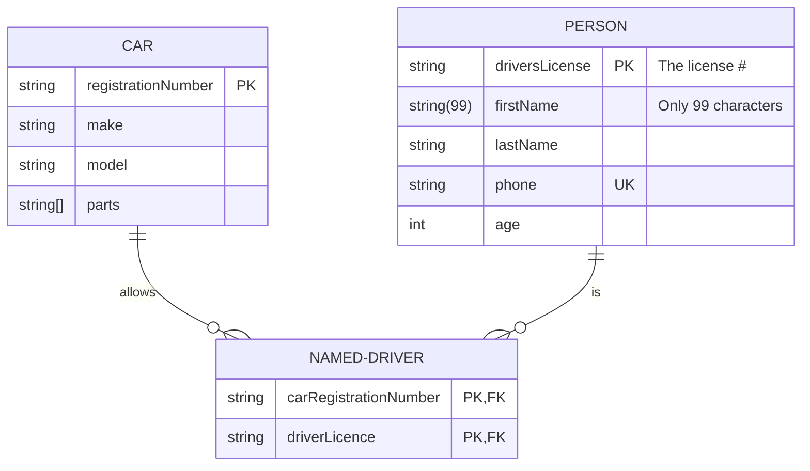

## Entity Name Aliases

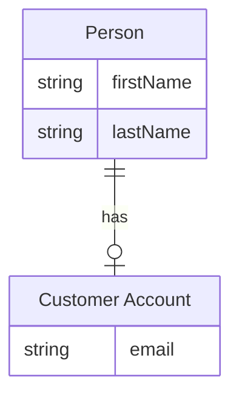

## Direction

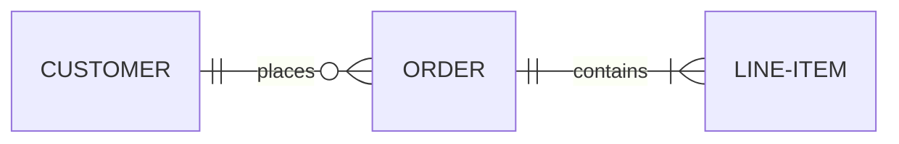

Options: `TB`, `BT`, `LR`, `RL`

## Styling

### Individual Node Styling
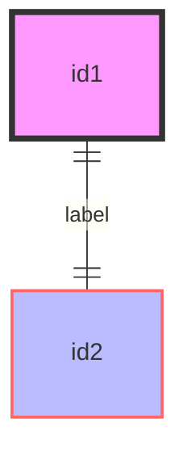

### Class Definitions
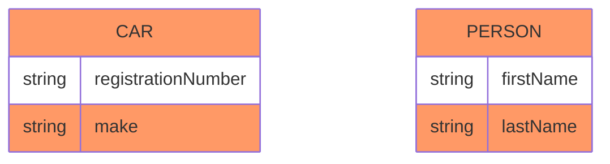

### Styling in Relationships
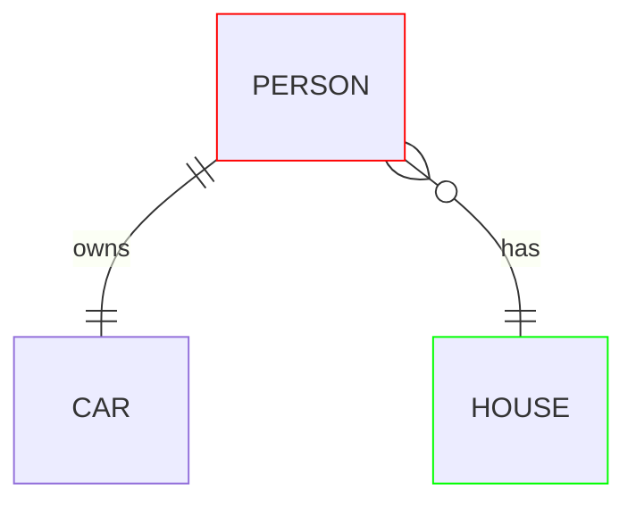

### Default Class
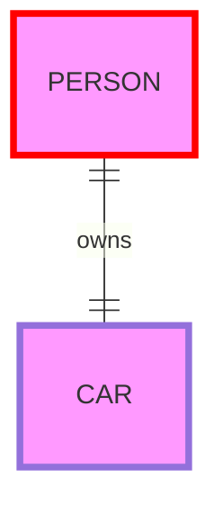

## Configuration

### ELK Layout
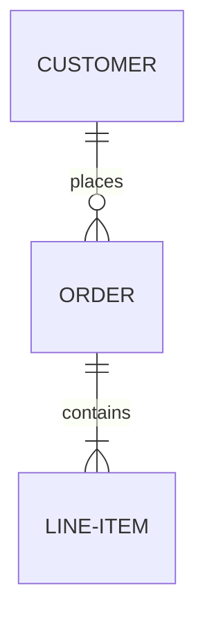

## Best Practices

### Entity Naming
- Use singular nouns for entity names
- Capitalize entity names
- Use meaningful, descriptive names

### Relationships
- Always provide relationship labels
- Use appropriate cardinality markers
- Choose identifying vs non-identifying carefully

### Attributes
- Specify data types for clarity
- Mark primary and foreign keys
- Add comments for complex attributes
- Use appropriate attribute types

### Foreign Keys
- Include foreign keys when modeling physical database
- Use identifying relationships when entity depends on parent
- Document key constraints clearly

## Common Patterns

### One-to-Many
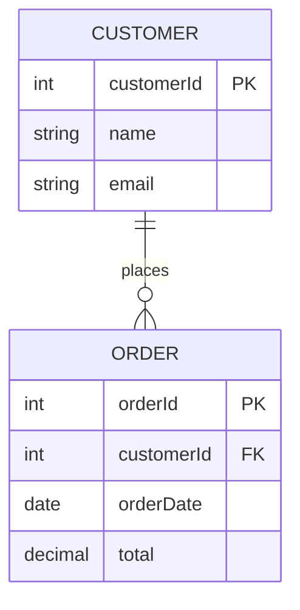

### Many-to-Many with Junction Table
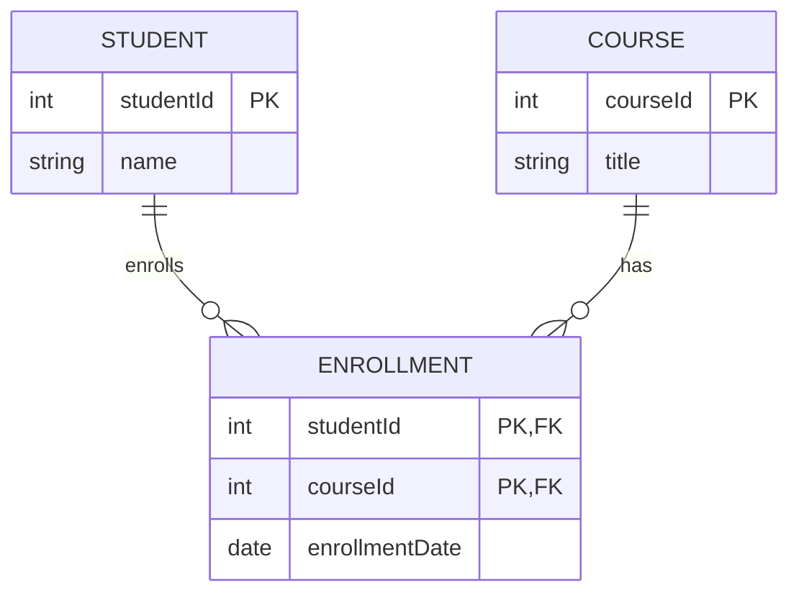

### Inheritance (Supertype/Subtype)
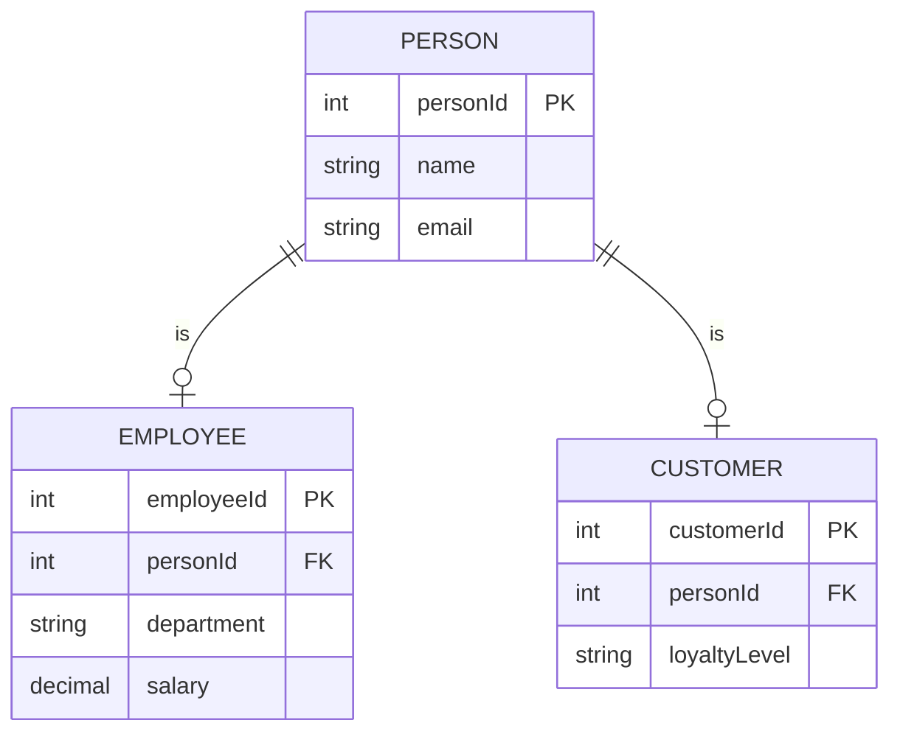

### Self-Referencing Relationship
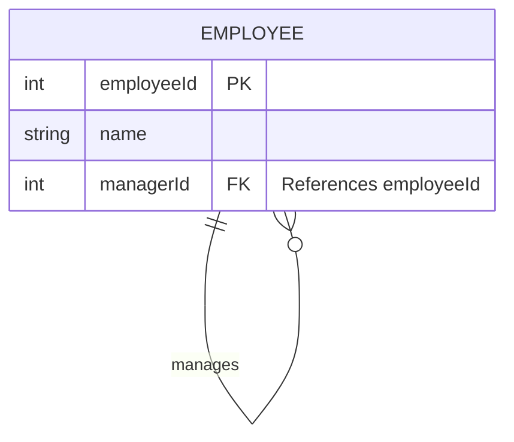

### E-Commerce Database
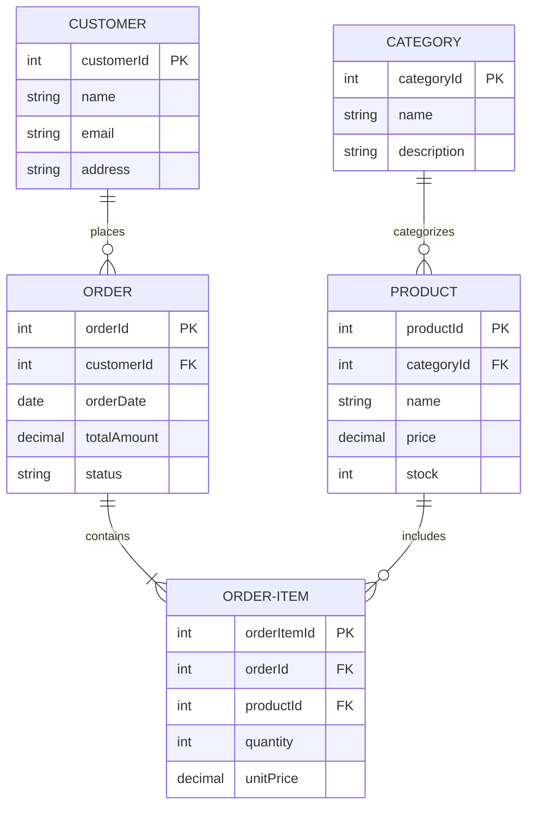

### Blog System
```mermaid
erDiagram
    USER ||--o{ POST : writes
    POST ||--o{ COMMENT : has
    USER ||--o{ COMMENT : makes
    POST }o--o{ TAG : tagged
    
    USER {
        int userId PK
        string username UK
        string email UK
        string passwordHash
    }
    POST {
        int postId PK
        int authorId FK
        string title
        text content
        datetime publishedAt
    }
    COMMENT {
        int commentId PK
        int postId FK
        int userId FK
        text content
        datetime createdAt
    }
    TAG {
        int tagId PK
        string name UK
    }
    POST_TAG {
        int postId PK, FK
        int tagId PK, FK
    }
```
