# Mermaid Gantt Diagrams

## Basic Syntax

### Simple Gantt Chart
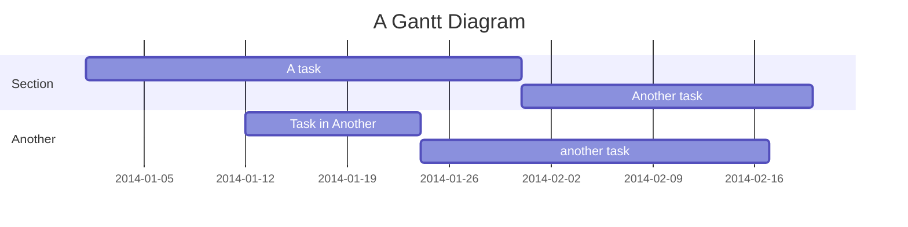

## Task Definition

### Task Syntax
```
[task description] :[tags], [id], [start], [end/duration]
```

### Task Tags

| Tag | Description |
|-----|-------------|
| `active` | Currently active task |
| `done` | Completed task |
| `crit` | Critical task |
| `milestone` | Milestone marker |

Tags are optional but must come first if used.

### Task Metadata Patterns

#### Three Items: ID, Start, End
```
Task name :taskId, 2014-01-01, 2014-01-15
Task name :taskId, 2014-01-01, 30d
```

#### Two Items: Start, End
```
Task name :2014-01-01, 2014-01-15
Task name :2014-01-01, 30d
```

#### One Item: Duration or End
```
Task name :30d
Task name :2014-01-15
```

### Using `after` Keyword
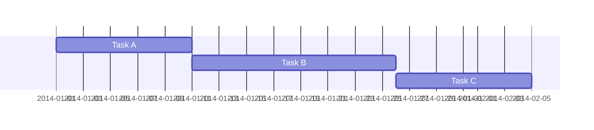

### Using `until` Keyword (v10.9.0+)
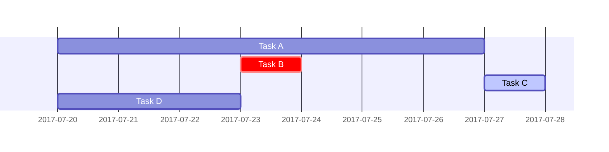

## Title

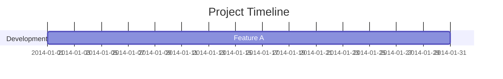

## Excludes

### Exclude Weekends


### Exclude Specific Dates
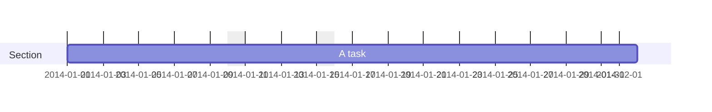

### Custom Weekend (v11.0.0+)
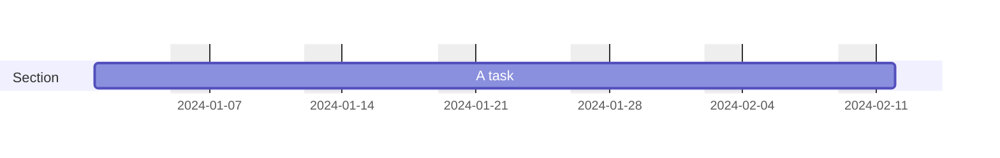

Default weekend: Saturday-Sunday. Use `weekend friday` for Friday-Saturday.

## Sections

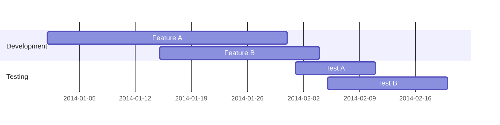

## Milestones

```mermaid
gantt
    dateFormat HH:mm
    axisFormat %H:%M
    Initial milestone : milestone, m1, 17:49, 2m
    Task A : 10m
    Task B : 5m
    Final milestone : milestone, m2, 18:08, 4m
```

## Vertical Markers

```mermaid
gantt
    dateFormat HH:mm
    axisFormat %H:%M
    Initial vert : vert, v1, 17:30, 2m
    Task A : 3m
    Task B : 8m
    Final vert : vert, v2, 17:58, 4m
```

## Date Formats

### Input Date Format (`dateFormat`)

```mermaid
gantt
    dateFormat YYYY-MM-DD
```

Common formats:
- `YYYY-MM-DD` - 2014-01-06
- `YYYY-MM-DD HH:mm` - 2014-01-06 14:30
- `HH:mm` - 14:30
- `DD/MM/YYYY` - 06/01/2014

Format tokens:
- `YYYY` - 4 digit year
- `YY` - 2 digit year
- `MM` - Month number (01-12)
- `MMM` - Month name (Jan-Dec)
- `DD` - Day of month (01-31)
- `HH` - 24 hour (00-23)
- `mm` - Minutes (00-59)
- `ss` - Seconds (00-59)

### Output Date Format (`axisFormat`)

```mermaid
gantt
    dateFormat YYYY-MM-DD
    axisFormat %Y-%m-%d
```

Format tokens:
- `%Y` - Year with century
- `%y` - Year without century
- `%m` - Month as decimal (01-12)
- `%b` - Abbreviated month name
- `%B` - Full month name
- `%d` - Day of month (01-31)
- `%H` - Hour 24-hour (00-23)
- `%I` - Hour 12-hour (01-12)
- `%M` - Minute (00-59)
- `%p` - AM or PM

### Axis Ticks (v10.3.0+)

```mermaid
gantt
    tickInterval 1week
    weekday monday
```

Intervals: `millisecond`, `second`, `minute`, `hour`, `day`, `week`, `month`

Pattern: `/^([1-9][0-9]*)(millisecond|second|minute|hour|day|week|month)$/`

## Compact Mode

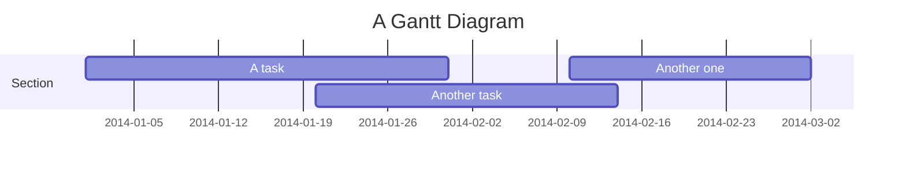

## Comments

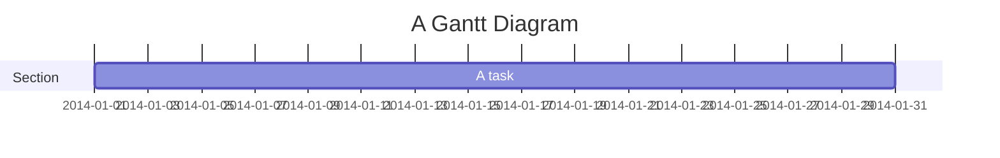

## Styling

### CSS Classes
- `grid.tick` - Grid lines
- `grid.path` - Grid borders
- `.taskText` - Task text
- `.taskTextOutsideRight` - Task text exceeding right
- `.taskTextOutsideLeft` - Task text exceeding left
- `todayMarker` - Today marker styling

### Today Marker

Enable/style:
```mermaid
gantt
    todayMarker stroke-width:5px,stroke:#0f0,opacity:0.5
```

Disable:
```mermaid
gantt
    todayMarker off
```

## Interaction

### Click Events
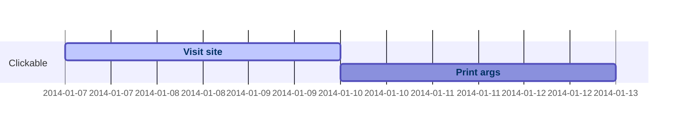

Note: Requires `securityLevel: 'loose'`

## Best Practices

### Task Planning
- Use meaningful task IDs for dependencies
- Group related tasks in sections
- Mark critical path tasks with `crit` tag
- Use milestones for important deadlines

### Date Management
- Use consistent date formats
- Exclude non-working days appropriately
- Set realistic task durations
- Account for dependencies

### Visual Clarity
- Keep section names short
- Use compact mode for many tasks
- Apply consistent formatting
- Mark current date with today marker

## Common Patterns

### Project Timeline
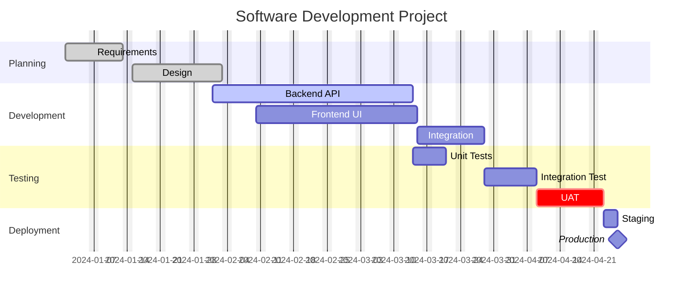

### Sprint Planning
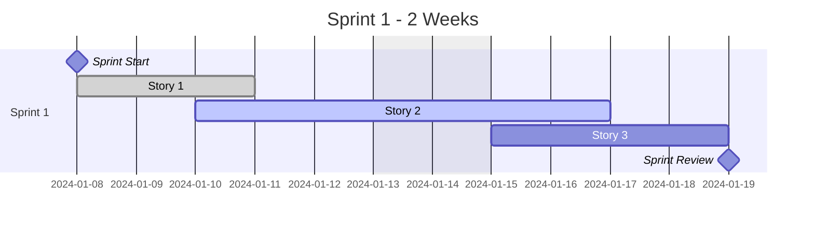

### Release Schedule
```mermaid
gantt
    title Release Timeline
    dateFormat YYYY-MM-DD
    
    section Q1
        Feature Freeze  :milestone, 2024-03-15, 0d
        Testing        :crit, 2024-03-16, 10d
        Release 1.0    :milestone, 2024-03-29, 0d
    
    section Q2
        Feature Freeze  :milestone, 2024-06-15, 0d
        Testing        :crit, 2024-06-16, 10d
        Release 2.0    :milestone, 2024-06-29, 0d
```

### Resource Allocation
```mermaid
gantt
    title Team Resource Allocation
    dateFormat YYYY-MM-DD
    
    section Team A
        Project Alpha   :done, a1, 2024-01-01, 30d
        Project Beta    :active, a2, 2024-02-01, 20d
    
    section Team B
        Project Gamma   :b1, 2024-01-15, 25d
        Project Delta   :crit, b2, after b1, 15d
```

### Dependencies Example
```mermaid
gantt
    title Task Dependencies
    dateFormat YYYY-MM-DD
    
    section Phase 1
        Task A :a, 2024-01-01, 10d
        Task B :b, 2024-01-05, 15d
    
    section Phase 2
        Task C :c, after a, 12d
        Task D :d, after a b, 8d
    
    section Phase 3
        Final Task :crit, after c d, 5d
        Completion :milestone, after c d, 0d
```
