# Mermaid GitGraph Diagrams

## Basic Syntax

### Simple GitGraph
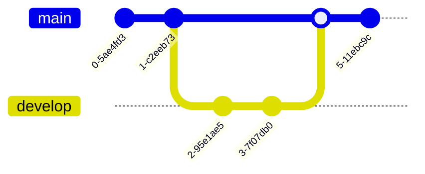

## Commits

### Basic Commit
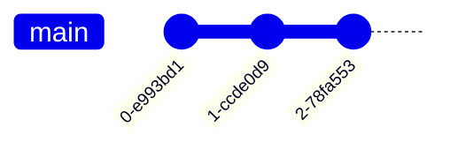

### Custom Commit ID
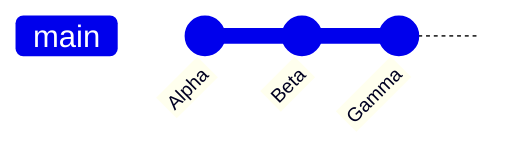

### Commit Types

| Type | Description | Visual |
|------|-------------|--------|
| `NORMAL` | Default commit | Solid circle |
| `REVERSE` | Reverse commit | Crossed circle |
| `HIGHLIGHT` | Highlighted commit | Filled rectangle |

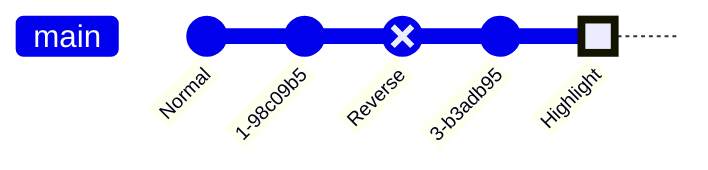

### Tags
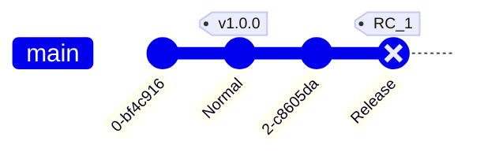

## Branches

### Create Branch
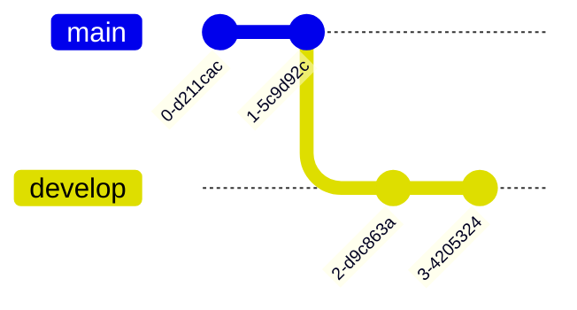

Note: `branch` creates and checks out the new branch automatically.

### Checkout Existing Branch
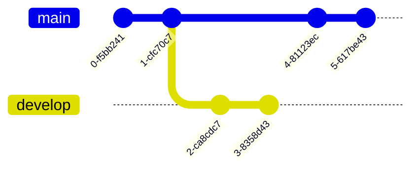

Note: `checkout` and `switch` are interchangeable.

### Branch Names with Special Characters
Use quotes for branch names that could be confused with keywords:
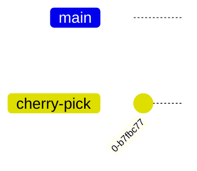

## Merging

### Basic Merge
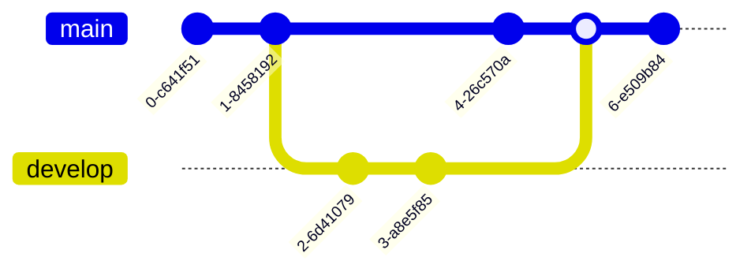

### Merge with Attributes
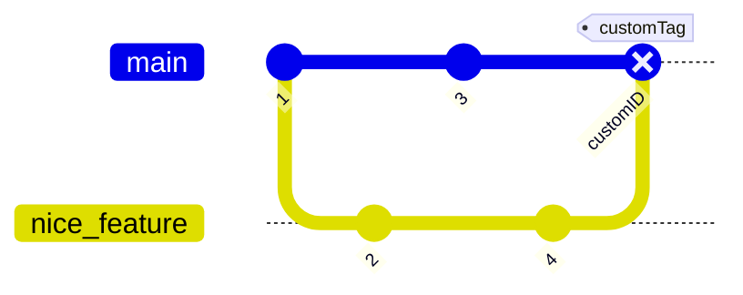

## Cherry-Pick

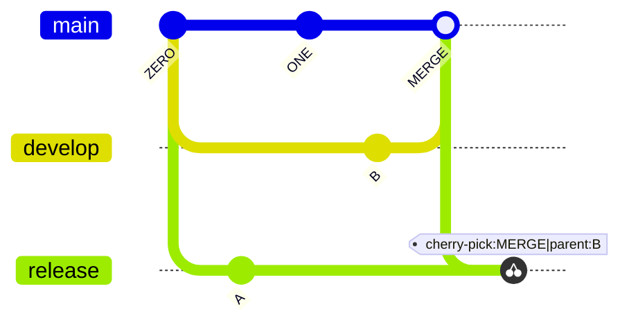

### Cherry-Pick Rules
1. Must provide existing commit ID
2. Commit must be on different branch
3. Current branch needs at least one commit
4. For merge commits, parent attribute is mandatory
5. Parent must be immediate parent of merge commit

## Configuration Options

### Show/Hide Branches
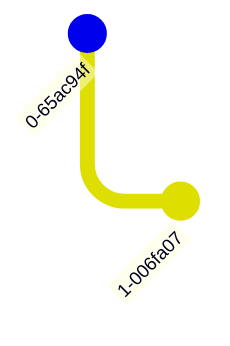

### Show/Hide Commit Labels
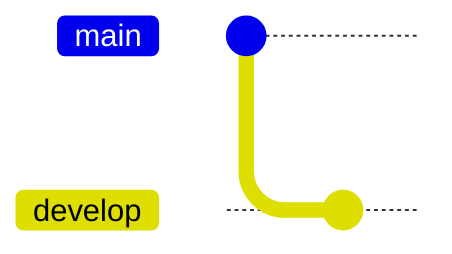

### Custom Main Branch Name
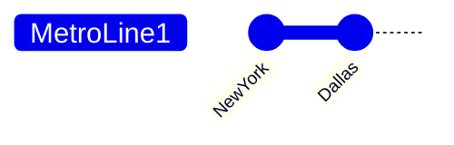

### Commit Label Rotation
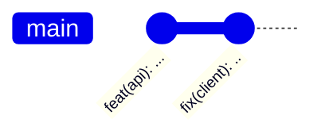

Set to `false` for horizontal labels.

### Branch Ordering

#### Default Order
Branches appear in order of definition.

#### Custom Order
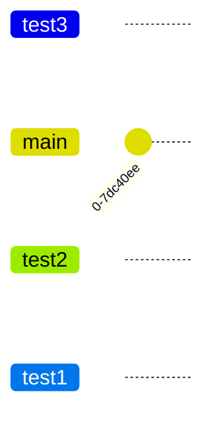

## Orientation

### Left to Right (Default)
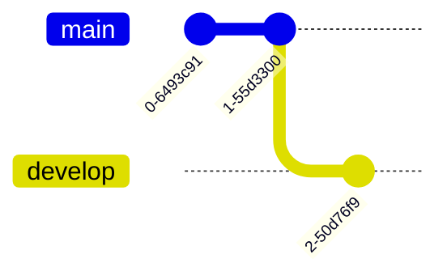

### Top to Bottom
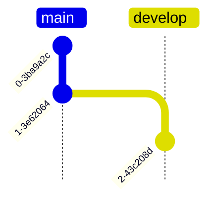

### Bottom to Top (v11.0.0+)
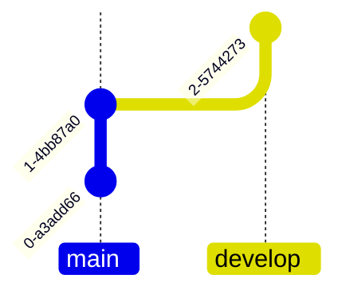

## Parallel Commits (v10.8.0+)

### Temporal (Default)
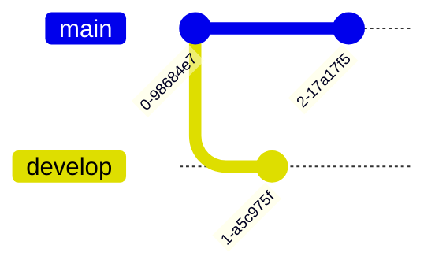

### Parallel
```mermaid
---
config:
    gitGraph:
        parallelCommits: true
---
gitGraph:
    commit
    branch develop
    commit
    checkout main
    commit
```

## Themes

### Available Themes
- `base`
- `forest`
- `default`
- `dark`
- `neutral`

```mermaid
---
config:
    theme: 'forest'
---
gitGraph
    commit
    branch develop
    commit
```

## Theme Variables

### Branch Colors (`git0` to `git7`)
```mermaid
---
config:
    themeVariables:
        'git0': '#ff0000'
        'git1': '#00ff00'
        'git2': '#0000ff'
---
gitGraph
    commit
    branch develop
    commit
```

### Branch Label Colors (`gitBranchLabel0` to `gitBranchLabel7`)
```mermaid
---
config:
    themeVariables:
        'gitBranchLabel0': '#ffffff'
        'gitBranchLabel1': '#ffffff'
---
gitGraph
    commit
    branch develop
    commit
```

### Commit Colors
```mermaid
---
config:
    themeVariables:
        commitLabelColor: '#ff0000'
        commitLabelBackground: '#00ff00'
        commitLabelFontSize: '16px'
---
gitGraph
    commit
```

### Tag Colors
```mermaid
---
config:
    themeVariables:
        tagLabelColor: '#ff0000'
        tagLabelBackground: '#00ff00'
        tagLabelBorder: '#0000ff'
        tagLabelFontSize: '16px'
---
gitGraph
    commit tag: "v1.0.0"
```

### Highlight Commit Colors (`gitInv0` to `gitInv7`)
```mermaid
---
config:
    themeVariables:
        'gitInv0': '#ff0000'
---
gitGraph
    commit
    commit type: HIGHLIGHT
```

## Debugging Common Errors

### Error: "Expecting: one of these possible Token sequences... but found: 'message'"

**Cause**: Attempting to use a `message` attribute. GitGraph doesn't support separate message fields.

**Problem:**
```mermaid
gitGraph
    commit id: "08a4682" message: "Configure Renovate"  # ❌ WRONG
```

**Solution**: Include messages in the `id` field using format `"hash: description"`:
```mermaid
gitGraph
    commit id: "08a4682: Configure Renovate"  # ✅ CORRECT
    commit id: "775236c: Update dependencies"
    commit id: "31fcb2f: Fix linting issues"
```

**Tips:**
- Keep messages concise (40-60 characters total)
- Use imperative mood: "Add feature" not "Added feature"
- Avoid quotes and multiple colons in messages
- For tickets: `"PROJ-202: Implement feature"`

### Error: "Cannot merge branch 'X' into itself"

**Cause**: Duplicate commit IDs or not checking out the target branch before merging.

**Problem:**
```mermaid
gitGraph
    commit id: "A"
    branch feature
    checkout feature
    commit id: "B"
    checkout main
    merge feature
    commit id: "B"  # ❌ Duplicate ID
```

**Solution**: Ensure unique IDs and explicit branch checkout:
```mermaid
gitGraph
    commit id: "A"
    branch feature
    checkout feature
    commit id: "B"
    checkout main
    merge feature
    commit id: "C"  # ✅ Unique ID
```

### Error: "Commits on wrong branch"

**Cause**: Adding commits after branching without explicit checkout.

**Problem:**
```mermaid
gitGraph
    commit id: "1"
    branch develop
    commit id: "2"  # ❌ Which branch?
    checkout main
    merge develop
```

**Solution**: Always checkout before adding commits:
```mermaid
gitGraph
    commit id: "1"
    branch develop
    checkout develop
    commit id: "2"  # ✅ Explicitly on develop
    checkout main
    merge develop
```

### Quick Debugging Checklist

- [ ] All commit IDs are unique across all branches
- [ ] Each branch is explicitly checked out before commits
- [ ] Merges happen from the target branch (checkout first)
- [ ] No `message` attribute (use `id: "hash: message"` instead)
- [ ] No duplicate branch names
- [ ] No commits after merge without explicit checkout

## Best Practices

### Branch Strategy
- Use meaningful branch names
- Follow consistent naming conventions
- Document branch purpose with tags

### Commits
- Use custom IDs for important commits
- Add tags for releases and milestones
- Use HIGHLIGHT type for important commits
- Use REVERSE type for reverts

### Visual Clarity
- Choose appropriate orientation
- Use commit labels for context
- Apply consistent styling
- Group related branches logically

## Common Patterns

### Git Flow
```mermaid
gitGraph
    commit
    commit
    branch develop
    checkout develop
    commit
    commit
    branch feature
    checkout feature
    commit
    commit
    checkout develop
    merge feature
    branch release
    checkout release
    commit tag: "v1.0.0-rc1"
    checkout main
    merge release tag: "v1.0.0"
    checkout develop
    merge release
```

### Feature Branch Workflow
```mermaid
gitGraph
    commit id: "init"
    branch feature-auth
    checkout feature-auth
    commit id: "add login"
    commit id: "add logout"
    checkout main
    branch feature-ui
    commit id: "update ui"
    checkout main
    merge feature-auth tag: "auth-complete"
    merge feature-ui tag: "ui-complete"
    commit id: "deploy" type: HIGHLIGHT
```

### Hotfix Workflow
```mermaid
gitGraph
    commit
    commit tag: "v1.0.0"
    branch develop
    checkout develop
    commit
    commit
    checkout main
    branch hotfix
    commit id: "critical-fix" type: REVERSE
    checkout main
    merge hotfix tag: "v1.0.1"
    checkout develop
    merge hotfix
```

### Release Branch
```mermaid
gitGraph
    commit
    branch develop
    commit
    commit
    branch release/1.0
    commit id: "version bump"
    commit id: "changelog"
    checkout main
    merge release/1.0 tag: "v1.0.0"
    checkout develop
    merge release/1.0
    commit
```

### Cherry-Pick Scenario
```mermaid
gitGraph
    commit id: "A"
    branch develop
    commit id: "B"
    commit id: "C"
    checkout main
    commit id: "D"
    branch hotfix
    cherry-pick id: "C" parent: "B"
    checkout main
    merge hotfix tag: "v1.0.1"
```

### Complex History with Descriptive Messages
```mermaid
gitGraph
    commit id: "08a4682: Configure Renovate"
    commit id: "775236c: Update dependencies"
    commit id: "31fcb2f: Fix linting issues"
    branch fix/http-errors
    checkout fix/http-errors
    commit id: "e7cf9b4: Fix HTTP transient errors" type: HIGHLIGHT
    checkout main
    merge fix/http-errors
    commit id: "e357315: Release v1.2.1"
    branch develop
    checkout develop
    commit id: "94e95af: Add model support"
    commit id: "273aea0: Implement registry"
    branch PROJ-202
    checkout PROJ-202
    commit id: "7ec9d1c: Start feature work"
    commit id: "23f54a6: Generate indexes" type: HIGHLIGHT tag: "HEAD"
    checkout develop
    merge PROJ-202 tag: "v1.3"
    checkout main
    merge develop tag: "v1.3-release"
```
