# Mermaid Sequence Diagrams

## Basic Syntax

### Diagram Declaration
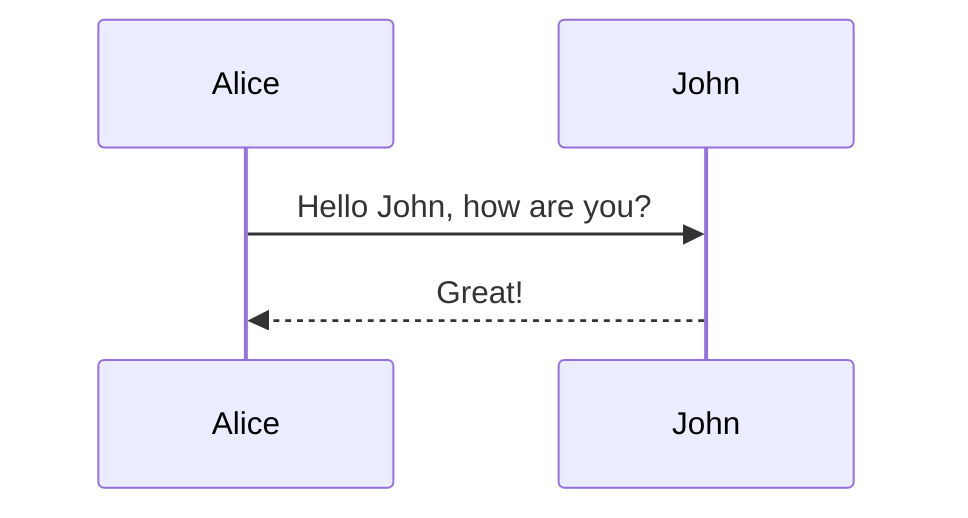
```mermaid
sequenceDiagram
    Alice->>John: Hello John, how are you?
    John-->>Alice: Great!
```

## Participants and Actors

### Explicit Participant Declaration
Declare participants to control their order of appearance:
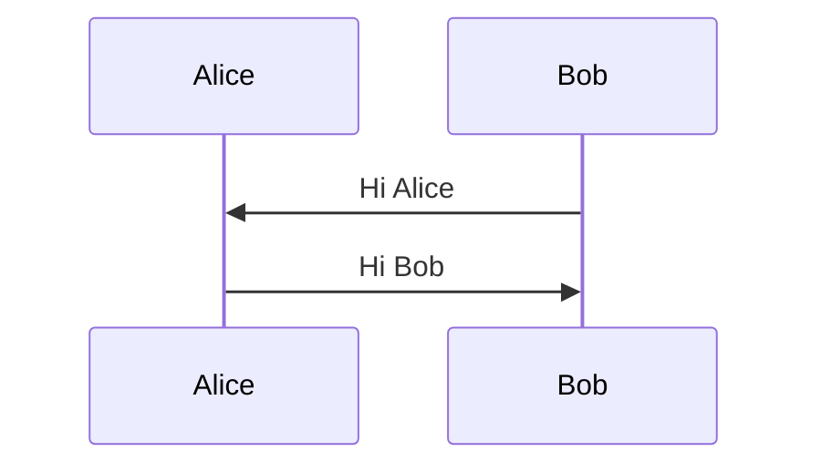
```mermaid
sequenceDiagram
    participant Alice
    participant Bob
    Bob->>Alice: Hi Alice
    Alice->>Bob: Hi Bob
```

### Actor Symbols
Use `actor` instead of `participant` for human-like symbols:
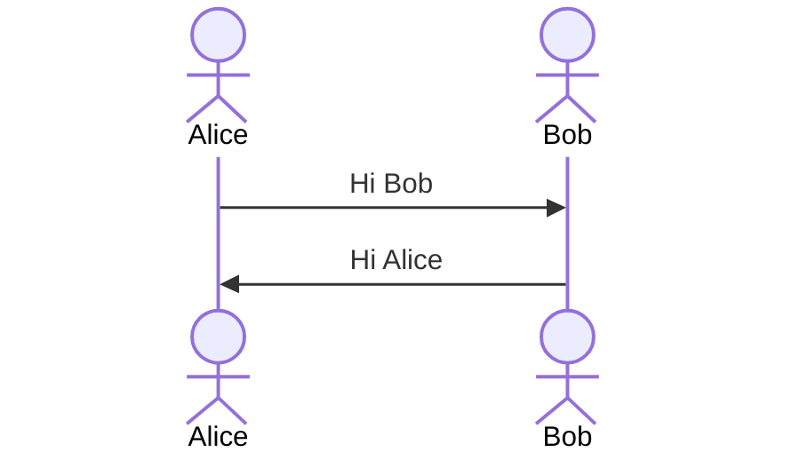
```mermaid
sequenceDiagram
    actor Alice
    actor Bob
    Alice->>Bob: Hi Bob
    Bob->>Alice: Hi Alice
```

### Specialized Participant Types
Use JSON configuration syntax for specialized symbols:

- **Boundary**: `participant Alice@{ "type" : "boundary" }`
- **Control**: `participant Alice@{ "type" : "control" }`
- **Entity**: `participant Alice@{ "type" : "entity" }`
- **Database**: `participant Alice@{ "type" : "database" }`
- **Collections**: `participant Alice@{ "type" : "collections" }`
- **Queue**: `participant Alice@{ "type" : "queue" }`

### Aliases
Use aliases for cleaner diagrams:
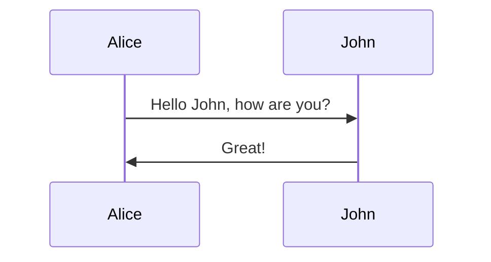
```mermaid
sequenceDiagram
    participant A as Alice
    participant J as John
    A->>J: Hello John, how are you?
    J->>A: Great!
```

### Actor Creation and Destruction (v10.3.0+)
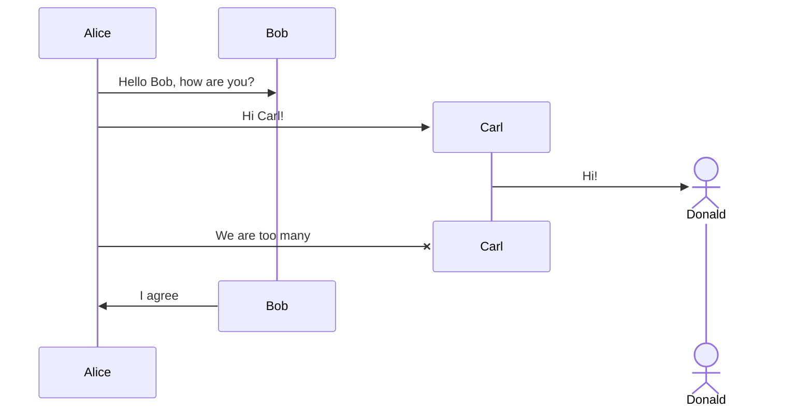
```mermaid
sequenceDiagram
    Alice->>Bob: Hello Bob, how are you?
    create participant Carl
    Alice->>Carl: Hi Carl!
    create actor D as Donald
    Carl->>D: Hi!
    destroy Carl
    Alice-xCarl: We are too many
    destroy Bob
    Bob->>Alice: I agree
```

### Grouping with Boxes
Group related participants in colored boxes:
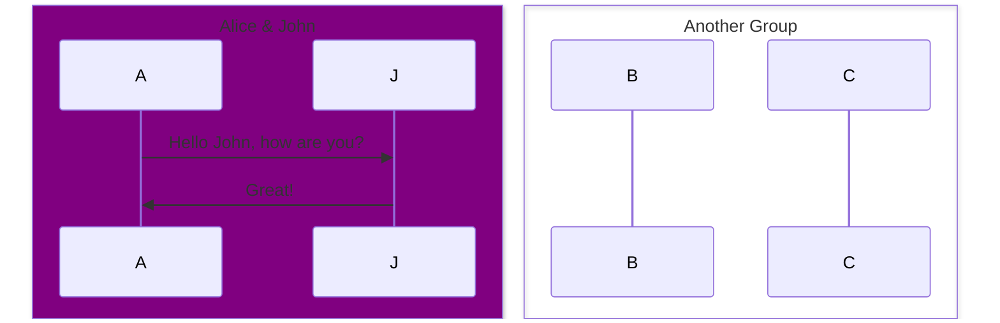
```mermaid
sequenceDiagram
    box Purple Alice & John
    participant A
    participant J
    end
    box Another Group
    participant B
    participant C
    end
    A->>J: Hello John, how are you?
    J->>A: Great!
```

Color options:
- Named colors: `box Purple Description`
- RGB: `box rgb(33,66,99)`
- RGBA: `box rgba(33,66,99,0.5)`
- Transparent: `box transparent Aqua`

## Message Types

### Arrow Types
| Syntax | Description |
|--------|-------------|
| `->` | Solid line without arrow |
| `-->` | Dotted line without arrow |
| `->>` | Solid line with arrowhead |
| `-->>` | Dotted line with arrowhead |
| `<<->>` | Solid line with bidirectional arrowheads (v11.0.0+) |
| `<<-->>` | Dotted line with bidirectional arrowheads (v11.0.0+) |
| `-x` | Solid line with cross at end |
| `--x` | Dotted line with cross at end |
| `-)` | Solid line with open arrow (async) |
| `--)` | Dotted line with open arrow (async) |

## Activations

### Explicit Activation
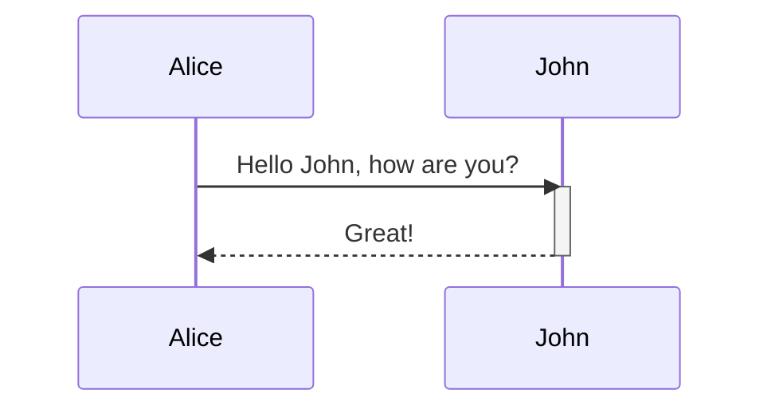
```mermaid
sequenceDiagram
    Alice->>John: Hello John, how are you?
    activate John
    John-->>Alice: Great!
    deactivate John
```

### Shortcut Notation
Use `+` to activate, `-` to deactivate:
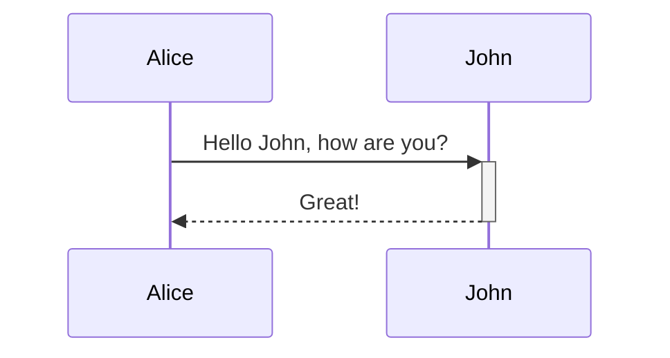
```mermaid
sequenceDiagram
    Alice->>+John: Hello John, how are you?
    John-->>-Alice: Great!
```

### Stacked Activations
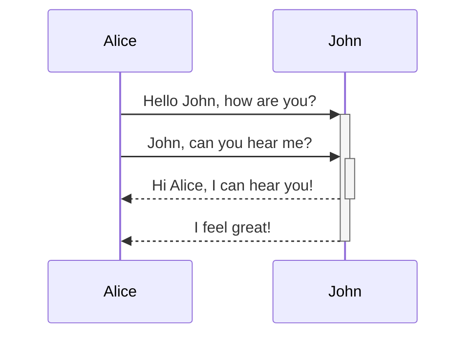
```mermaid
sequenceDiagram
    Alice->>+John: Hello John, how are you?
    Alice->>+John: John, can you hear me?
    John-->>-Alice: Hi Alice, I can hear you!
    John-->>-Alice: I feel great!
```

## Notes

### Basic Notes
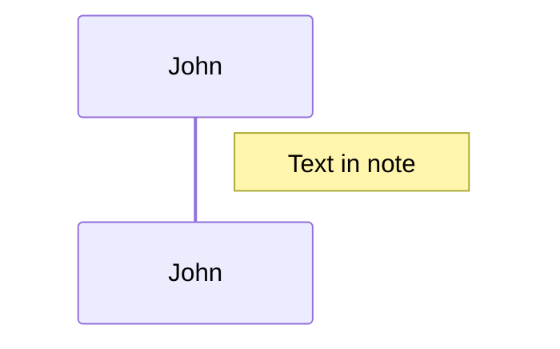
```mermaid
sequenceDiagram
    participant John
    Note right of John: Text in note
```

Positions: `right of`, `left of`, or `over`

### Spanning Notes
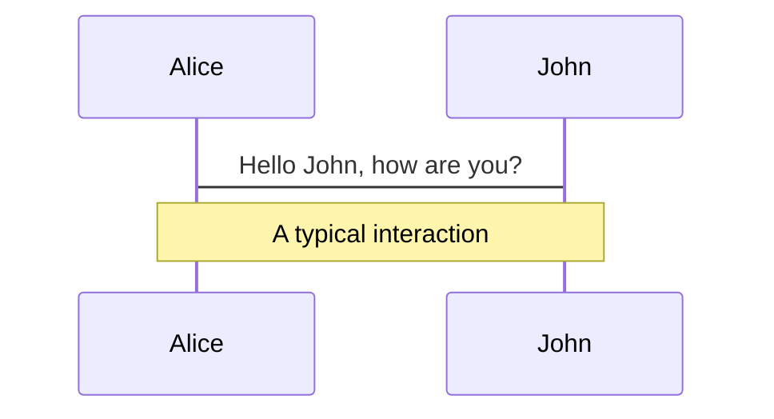
```mermaid
sequenceDiagram
    Alice->John: Hello John, how are you?
    Note over Alice,John: A typical interaction
```

## Line Breaks

Use `<br/>` for line breaks in messages and notes:
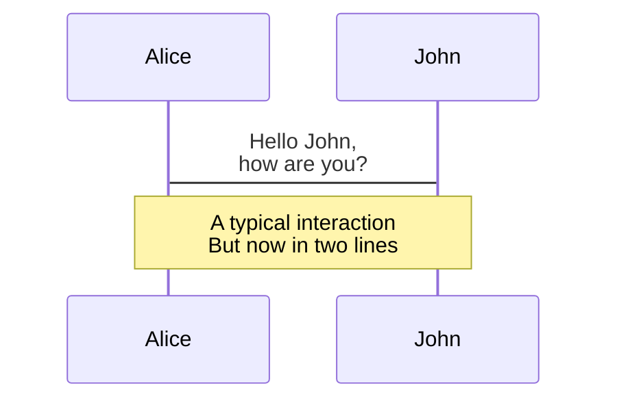
```mermaid
sequenceDiagram
    Alice->John: Hello John,<br/>how are you?
    Note over Alice,John: A typical interaction<br/>But now in two lines
```

For actor names, use aliases with `<br/>`:
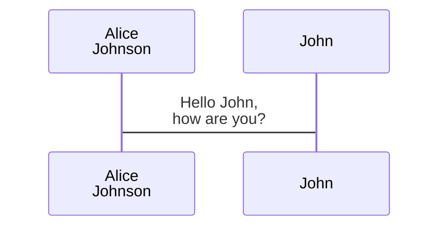
```mermaid
sequenceDiagram
    participant Alice as Alice<br/>Johnson
    Alice->John: Hello John,<br/>how are you?
```

## Control Flow Structures

### Loops
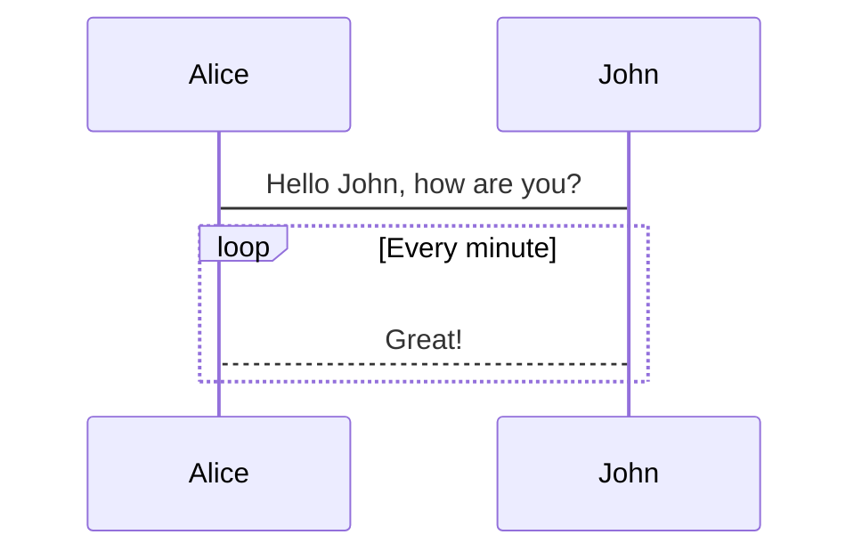
```mermaid
sequenceDiagram
    Alice->John: Hello John, how are you?
    loop Every minute
        John-->Alice: Great!
    end
```

### Alternatives (alt/else)
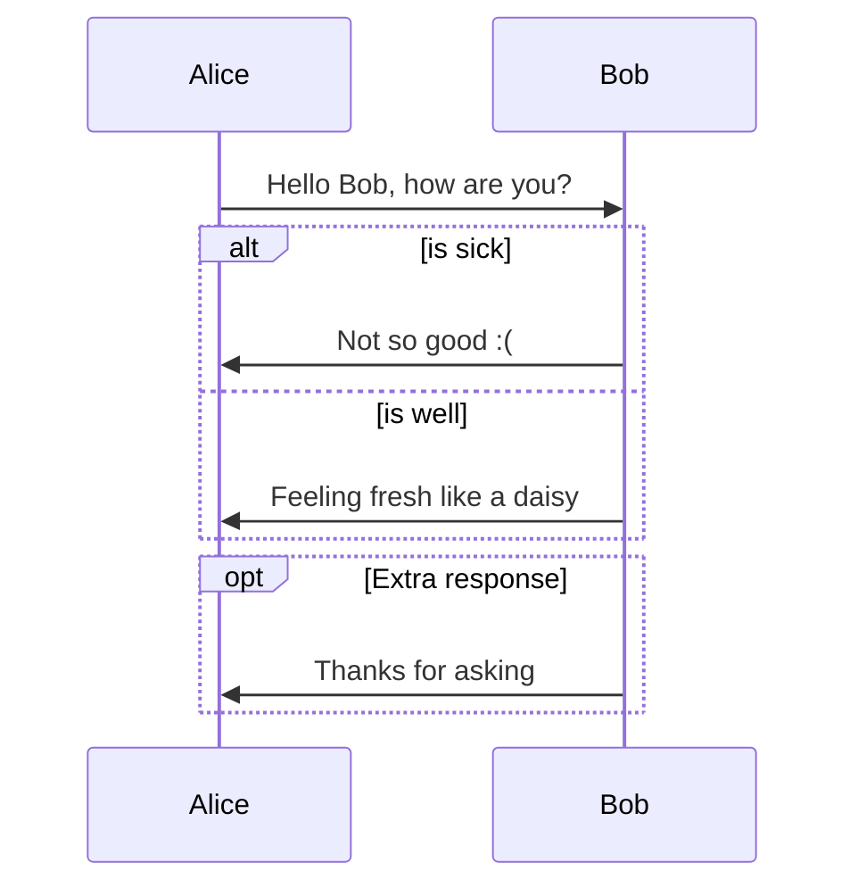
```mermaid
sequenceDiagram
    Alice->>Bob: Hello Bob, how are you?
    alt is sick
        Bob->>Alice: Not so good :(
    else is well
        Bob->>Alice: Feeling fresh like a daisy
    end
    opt Extra response
        Bob->>Alice: Thanks for asking
    end
```

### Parallel Actions
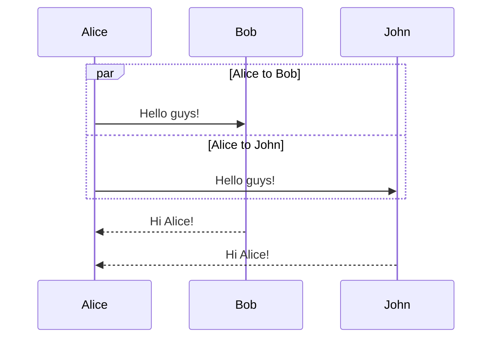
```mermaid
sequenceDiagram
    par Alice to Bob
        Alice->>Bob: Hello guys!
    and Alice to John
        Alice->>John: Hello guys!
    end
    Bob-->>Alice: Hi Alice!
    John-->>Alice: Hi Alice!
```

Parallel blocks can be nested.

### Critical Regions
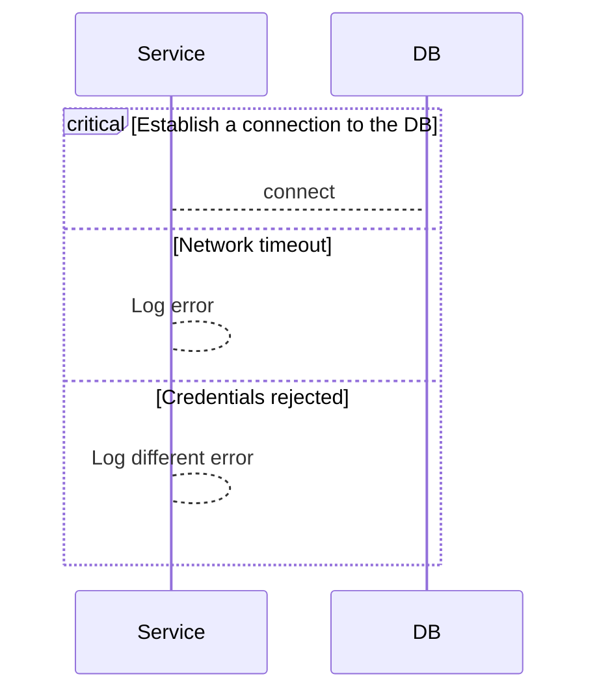
```mermaid
sequenceDiagram
    critical Establish a connection to the DB
        Service-->DB: connect
    option Network timeout
        Service-->Service: Log error
    option Credentials rejected
        Service-->Service: Log different error
    end
```

### Break
Stop sequence flow (for exceptions):
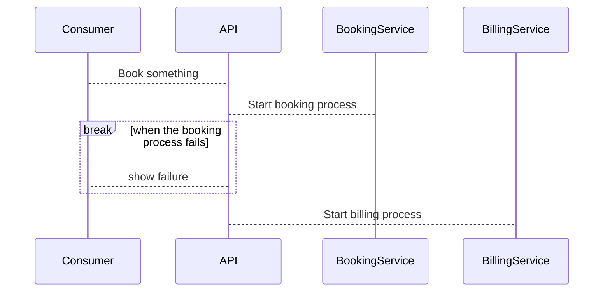
```mermaid
sequenceDiagram
    Consumer-->API: Book something
    API-->BookingService: Start booking process
    break when the booking process fails
        API-->Consumer: show failure
    end
    API-->BillingService: Start billing process
```

## Background Highlighting

Use `rect` to highlight flows with colored backgrounds:
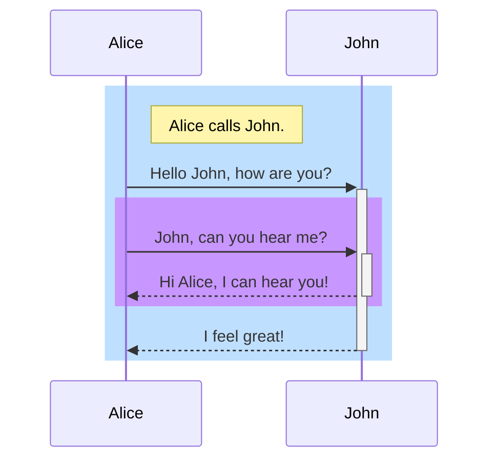
```mermaid
sequenceDiagram
    participant Alice
    participant John
    rect rgb(191, 223, 255)
    note right of Alice: Alice calls John.
    Alice->>+John: Hello John, how are you?
    rect rgb(200, 150, 255)
    Alice->>+John: John, can you hear me?
    John-->>-Alice: Hi Alice, I can hear you!
    end
    John-->>-Alice: I feel great!
    end
```

Colors: `rgb(0, 255, 0)` or `rgba(0, 0, 255, .1)`

## Additional Features

### Comments

```mermaid
sequenceDiagram
    Alice->>John: Hello John, how are you?
    %% this is a comment
    John-->>Alice: Great!
```

### Entity Codes
Escape special characters using HTML entity codes:
```mermaid
sequenceDiagram
    A->>B: I #9829; you!
    B->>A: I #9829; you #infin; times more!
```

Use `#35;` for `#`, `#59;` for semicolons in messages.

### Sequence Numbers
Enable automatic numbering:
```mermaid
sequenceDiagram
    autonumber
    Alice->>John: Hello John, how are you?
    loop HealthCheck
        John->>John: Fight against hypochondria
    end
    Note right of John: Rational thoughts!
    John-->>Alice: Great!
    John->>Bob: How about you?
    Bob-->>John: Jolly good!
```

### Actor Menus
Add clickable links to actors:
```mermaid
sequenceDiagram
    participant Alice
    participant John
    link Alice: Dashboard @ https://dashboard.contoso.com/alice
    link Alice: Wiki @ https://wiki.contoso.com/alice
    link John: Dashboard @ https://dashboard.contoso.com/john
    Alice->>John: Hello John, how are you?
```

Advanced JSON syntax:
```
links Alice: {"Dashboard": "https://dashboard.contoso.com/alice", "Wiki": "https://wiki.contoso.com/alice"}
```

## Best Practices

### Keep It Simple
- Use clear, concise message text
- Avoid overcrowding the diagram
- Use aliases for long participant names

### Proper Structure
- Declare participants explicitly when order matters
- Use grouping boxes for related components
- Add notes to clarify complex interactions

### Visual Clarity
- Use background highlighting sparingly
- Choose appropriate arrow types (solid for synchronous, dotted for responses)
- Use activation bars to show processing time

### Control Flow
- Use loops for repetitive actions
- Use alt/else for conditional paths
- Use par for concurrent operations
- Use critical for error handling scenarios
- Use break for exceptional flow termination

### Special Considerations
- Avoid using "end" in node names (use parentheses/quotes/brackets if needed)
- Use entity codes for special characters
- Add sequence numbers for complex diagrams with many steps

## Common Patterns

### Request-Response
```mermaid
sequenceDiagram
    Client->>+Server: Request
    Server-->>-Client: Response
```

### Error Handling
```mermaid
sequenceDiagram
    Client->>+API: Request
    API->>+Service: Process
    alt Success
        Service-->>API: Result
        API-->>Client: Success Response
    else Error
        Service-->>API: Error
        API-->>Client: Error Response
    end
    deactivate Service
    deactivate API
```

### Async Operations
```mermaid
sequenceDiagram
    Client-)Server: Async Request
    Note over Server: Processing...
    Server--)Client: Async Response
```

### Database Interaction
```mermaid
sequenceDiagram
    participant API
    participant DB@{ "type" : "database" }
    API->>+DB: Query
    DB-->>-API: Results
```

### Microservices Communication
```mermaid
sequenceDiagram
    box Gateway
    participant Gateway
    end
    box Services
    participant AuthService
    participant DataService
    end
    participant DB@{ "type" : "database" }
    
    Gateway->>+AuthService: Validate Token
    AuthService-->>-Gateway: Valid
    Gateway->>+DataService: Get Data
    DataService->>+DB: Query
    DB-->>-DataService: Results
    DataService-->>-Gateway: Response
```
