# Mermaid State Diagrams

## Basic Syntax

### Diagram Declaration
Use `stateDiagram-v2` for the modern renderer:
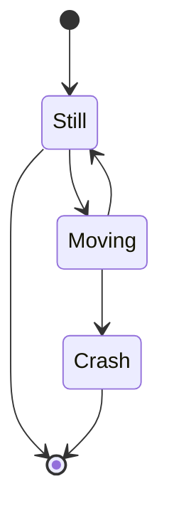

## States

### Simple State Declaration
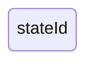

### State with Description
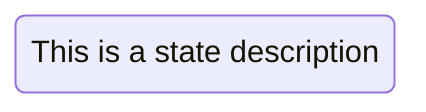

Or using colon syntax:


## Transitions

### Basic Transition
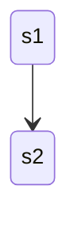

### Transition with Label
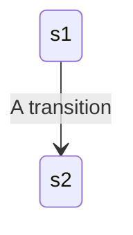

## Start and End States

Use `[*]` for start/end states:
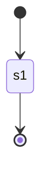

## Composite States

### Basic Composite State
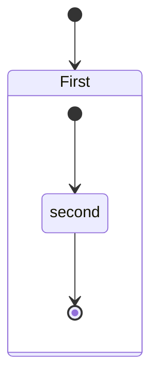

### Named Composite State
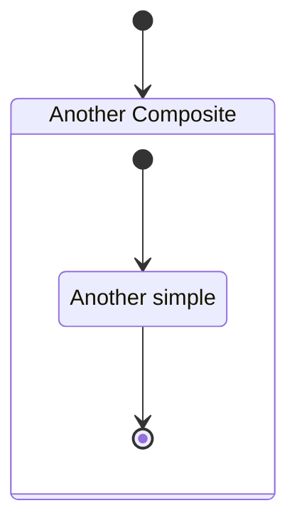

### Nested Composite States
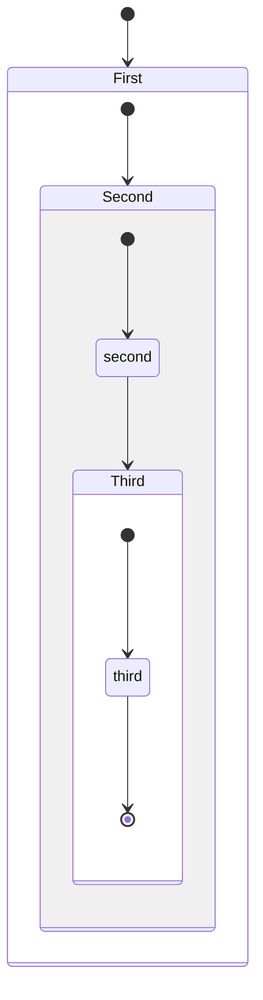

### Transitions Between Composite States
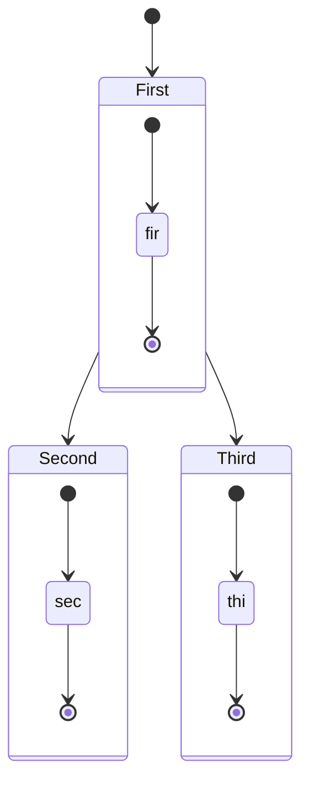

## Choice

Model conditional paths:
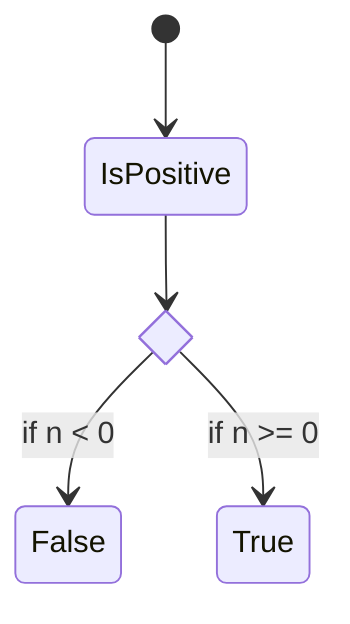

## Forks and Joins

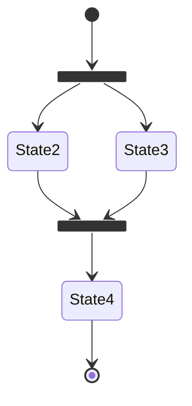

## Notes

### Right of State
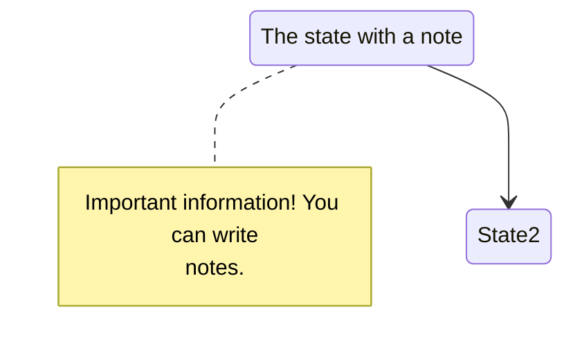

### Left of State
```mermaid
stateDiagram-v2
    note left of State2 : This is the note to the left.
```

## Concurrency

Use `--` to show concurrent regions:
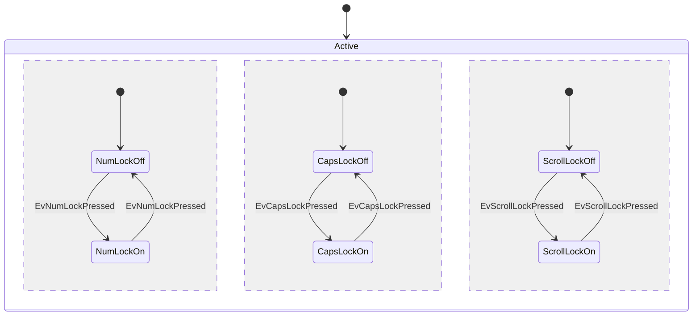

## Direction

Set diagram orientation:
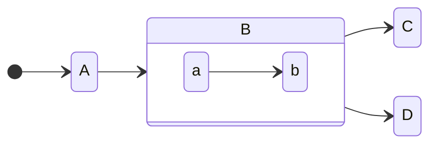

Options: `LR` (left-right), `RL` (right-left), `TB` (top-bottom), `BT` (bottom-top)

## Comments

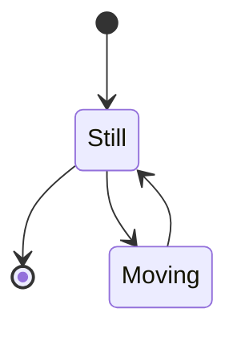

## Styling with classDefs

### Define Styles
```mermaid
stateDiagram
    classDef notMoving fill:white
    classDef movement font-style:italic
    classDef badBadEvent fill:#f00,color:white,font-weight:bold,stroke-width:2px,stroke:yellow
```

### Apply Styles - Method 1: class Statement
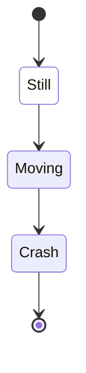

### Apply Styles - Method 2: ::: Operator
```mermaid
stateDiagram
    classDef notMoving fill:white
    
    [*] --> Still:::notMoving
    Still --> Moving:::movement
    Moving --> Crash:::movement
```

## Spaces in State Names

Use ID with description:
```mermaid
stateDiagram
    classDef yourState font-style:italic,font-weight:bold,fill:white
    
    yswsii: Your state with spaces in it
    [*] --> yswsii:::yourState
    yswsii --> YetAnotherState
    YetAnotherState --> [*]
```

## Best Practices

### Structure
- Use `stateDiagram-v2` for the modern renderer
- Use composite states to group related states
- Use meaningful state names and descriptions

### Visual Clarity
- Use notes to explain complex states
- Apply styling to highlight important states
- Use concurrency to show parallel processes

### Organization
- Group related states in composite states
- Use choice nodes for conditional logic
- Use fork/join for parallel execution paths

## Common Patterns

### Simple State Machine
```mermaid
stateDiagram-v2
    [*] --> Idle
    Idle --> Processing : start
    Processing --> Complete : success
    Processing --> Error : failure
    Complete --> [*]
    Error --> Idle : retry
```

### Nested States
```mermaid
stateDiagram-v2
    [*] --> Running
    
    state Running {
        [*] --> Active
        Active --> Paused : pause
        Paused --> Active : resume
        Active --> [*] : stop
    }
    
    Running --> [*]
```

### Choice Pattern
```mermaid
stateDiagram-v2
    [*] --> CheckInput
    
    state check <<choice>>
    CheckInput --> check
    check --> Valid : input valid
    check --> Invalid : input invalid
    
    Valid --> Process
    Invalid --> Error
    Process --> [*]
    Error --> [*]
```

### Concurrent States
```mermaid
stateDiagram-v2
    [*] --> System
    
    state System {
        [*] --> UI
        UI --> UI : user action
        --
        [*] --> Backend
        Backend --> Backend : process data
        --
        [*] --> Database
        Database --> Database : query
    }
```

### Error Handling
```mermaid
stateDiagram-v2
    classDef errorState fill:#f00,color:white
    
    [*] --> Initializing
    Initializing --> Ready : success
    Initializing --> Failed:::errorState : error
    Ready --> Processing
    Processing --> Complete : success
    Processing --> Failed:::errorState : error
    Failed --> Retry
    Retry --> Initializing : attempt
    Retry --> [*] : give up
    Complete --> [*]
```
